# TryHackMe — Athena

| Field          | Details                                                                 |
| -------------- | ----------------------------------------------------------------------- |
| **Platform**   | TryHackMe                                                               |
| **Room**       | [Athena](https://tryhackme.com/room/4th3n4)                             |
| **Difficulty** | Medium                                                                  |
| **Category**   | SMB Enumeration, Web Exploitation, Privilege Escalation, Kernel Rootkit |
| **OS**         | Linux                                                                   |

## Introduction

The Athena room on TryHackMe is an intermediate-level Linux exploitation and privilege escalation challenge. It focuses on SMB enumeration, remote code execution, cron jobs, and reverse engineering a rootkit.

In this write-up, I'll go through my methodology step by step, highlighting the reasoning behind each action.

---

## Reconnaissance

I started by identifying open ports and services running on the target machine using an Nmap scan.

```bash
nmap -sS -vv -T4 -p- $target --min-rate 2000 -oN initial.txt
```

```
# Nmap 7.95 scan initiated Thu May 21 11:52:13 2026 as: /usr/lib/nmap/nmap --privileged -sS -vv -T4 -p- --min-rate 2000 -oN initial.txt 10.49.136.169
Nmap scan report for 10.49.136.169
Host is up, received reset ttl 62 (0.050s latency).
Scanned at 2026-05-21 11:52:14 +0545 for 16s
Not shown: 65531 closed tcp ports (reset)
PORT    STATE SERVICE      REASON
22/tcp  open  ssh          syn-ack ttl 62
80/tcp  open  http         syn-ack ttl 62
139/tcp open  netbios-ssn  syn-ack ttl 62
445/tcp open  microsoft-ds syn-ack ttl 62

Read data files from: /usr/share/nmap
# Nmap done at Thu May 21 11:52:30 2026 -- 1 IP address (1 host up) scanned in 16.99 seconds
```

```bash
nmap -sS -vv -T4 -p 22,80,139,445 -A $target -oN advanced.txt
```

```
# Nmap 7.95 scan initiated Thu May 21 11:53:21 2026 as: /usr/lib/nmap/nmap --privileged -sS -vv -T4 -p 22,80,139,445 -A -oN advanced.txt 10.49.136.169
Nmap scan report for 10.49.136.169
Host is up, received echo-reply ttl 62 (0.047s latency).
Scanned at 2026-05-21 11:53:21 +0545 for 20s

PORT    STATE SERVICE     REASON         VERSION
22/tcp  open  ssh         syn-ack ttl 62 OpenSSH 8.2p1 Ubuntu 4ubuntu0.5 (Ubuntu Linux; protocol 2.0)
| ssh-hostkey:
|   3072 3b:c8:f8:13:e0:cb:42:60:0d:f6:4c:dc:55:d8:3b:ed (RSA)
| ssh-rsa AAAAB3NzaC1yc2EAAAADAQABAAABgQCqrhWpCkIWorEVg4w8mfia/rsblIvsmSU9y9mEBby77pooZXLBYMvMC0aiaJvWIgPVOXrHTh9IstAF6s9Tpjx+iV+Me2XdvUyGPmzAlbEJRO4gnNYieBya/0TyMmw0QT/PO8gu/behXQ9R6yCjiw9vmsV+99SiCeuIHssGoLtvTwXE2i8kxqr5S0atmBiDkIqlp+qD1WZzc8YP5OU0CIN5F9ytZOVqO9oiGRgI6CP4TwNQwBLU2zRBmUmtbV9FRQyObrB1zCYcEZcKNPzasXHgRkfYMK9OMmUBhi/Hveei3BNtdaWARN9x30O488BmdET3iaTt5gcIgHfAO+5WzUPBswerbcOHp2798DXkuVpsklS9Zi9dvpxoyZFsmu1RoklPWea+rxq09KRjciXNvy+jV8zBGCGKwwi62nL9mRyA5ZakJKrpWCPffnEMK37SHL0WqWMRZI4Bbj2cOpJztJ+5Ttbj5wixecnvZu8hkknfMSVwPM8RqwQuXtes8AqF6gs=
|   256 1f:42:e1:c3:a5:17:2a:38:69:3e:9b:73:6d:cd:56:33 (ECDSA)
| ecdsa-sha2-nistp256 AAAAE2VjZHNhLXNoYTItbmlzdHAyNTYAAAAIbmlzdHAyNTYAAABBBPBg1Oa6gqrvB/IQQ1EmM1p5o443v5y1zDwXMLkd9oUfYsraZqddzwe2CoYZD3/oTs/YjF84bDqeA+ILx7x5zdQ=
|   256 7a:67:59:8d:37:c5:67:29:e8:53:e8:1e:df:b0:c7:1e (ED25519)
|_ssh-ed25519 AAAAC3NzaC1lZDI1NTE5AAAAIBaJ6imGGkCETvb1JN5TUcfj+AWLbVei52kD/nuGSHGF
80/tcp  open  http        syn-ack ttl 62 Apache httpd 2.4.41 ((Ubuntu))
|_http-server-header: Apache/2.4.41 (Ubuntu)
|_http-title: Athena - Gods of olympus
| http-methods:
|_  Supported Methods: GET POST OPTIONS HEAD
139/tcp open  netbios-ssn syn-ack ttl 62 Samba smbd 4
445/tcp open  netbios-ssn syn-ack ttl 62 Samba smbd 4

Read data files from: /usr/share/nmap
OS and Service detection performed. Please report any incorrect results at https://nmap.org/submit/ .
# Nmap done at Thu May 21 11:53:41 2026 -- 1 IP address (1 host up) scanned in 20.22 seconds
```

The system appears to be a typical Linux machine with web + SMB + SSH exposed. The most promising initial vector is the HTTP service, with SMB as a secondary enumeration target.

The next thing I did was take a look at port 80, so I ran ffuf for directory enumeration.

```bash
ffuf -w /usr/share/seclists/Discovery/Web-Content/directory-list-2.3-medium.txt -u http://10.49.136.169/FUZZ -rate 2000 -t 200 -e .php
```

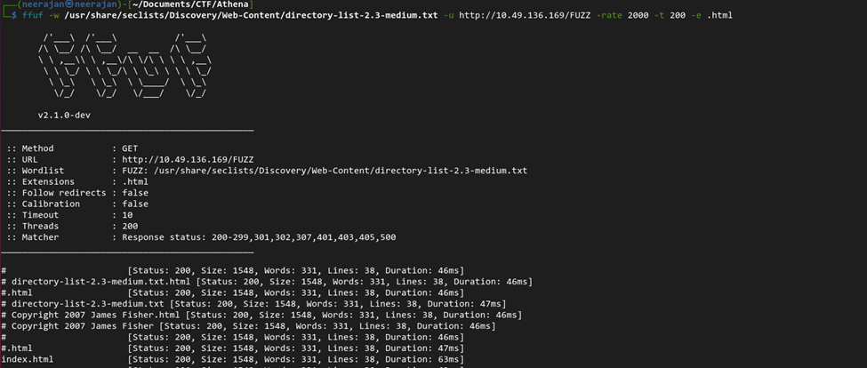

Hmmm, there wasn't much other than `index.html`, so I moved on to SMB enumeration to see if I could find anything more interesting there.

```bash
smbclient -L //10.49.136.169/
```

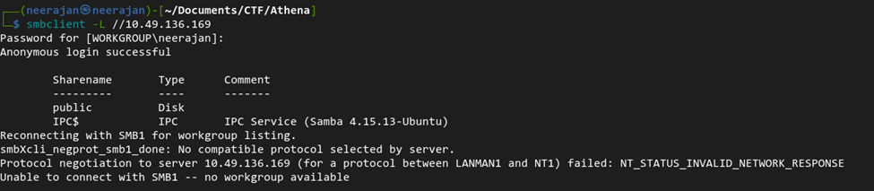

Using smbclient, I enumerated the available SMB shares and discovered a share named `public`. I accessed it to investigate further.

```bash
smbclient //10.49.136.169/public
```

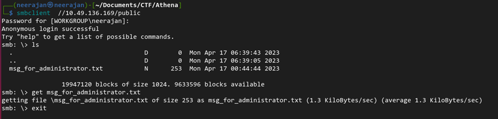

We found a text file named `msg_for_administrator.txt`. Let's read its contents.

```
Dear Administrator,

I would like to inform you that a new Ping system is being developed and I left the corresponding application
in a specific path, which can be accessed through the following address: /myrouterpanel

Yours sincerely,

Athena
Intern
```

It appears to be a message from an intern named Athena, and it reveals a path `/myrouterpanel` on the website. So let's check it out.

---

## Web Exploitation

Visiting the newly discovered route revealed a ping utility that accepts an IP address as input. This functionality raised suspicion of potential command injection, so I proceeded to test it for code execution vulnerabilities.


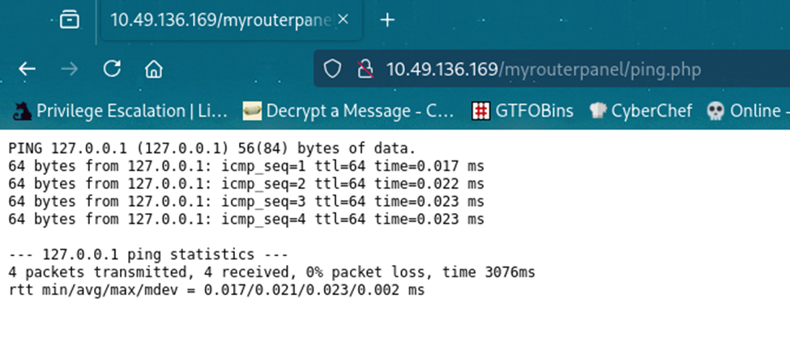

The input appears to be passed directly to the Linux `ping` command.

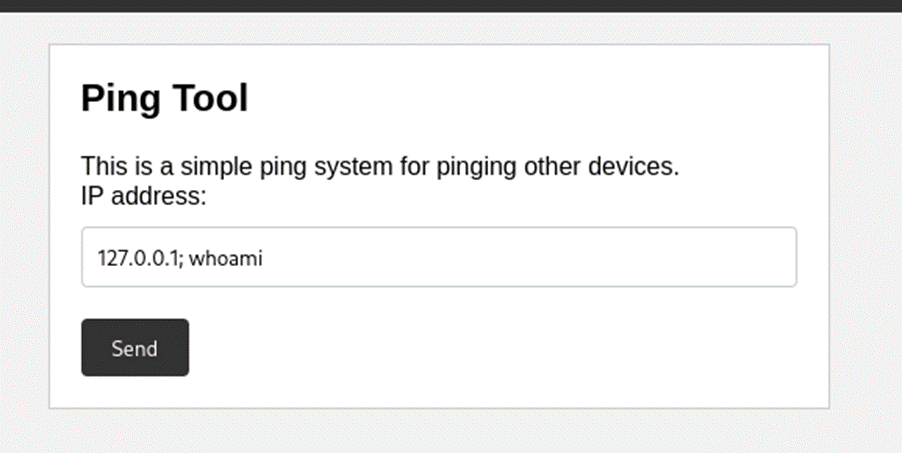

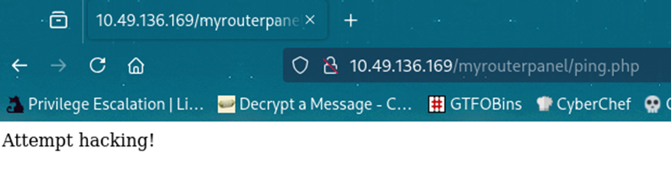

When attempting command injection, the page response suggests that certain inputs and characters are being filtered. After testing, I found that the characters `&`, `|`, and `;` were blocked. However, other techniques could still be used to achieve code execution, so I proceeded using `$( )`.

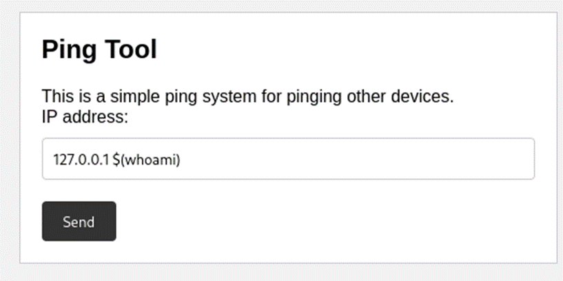

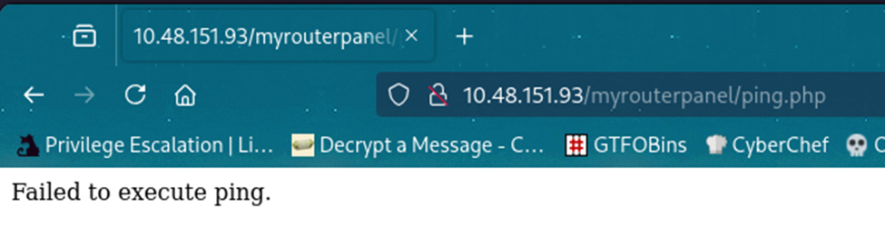

I encountered a new type of error. Hmm… I decided to try a different approach.

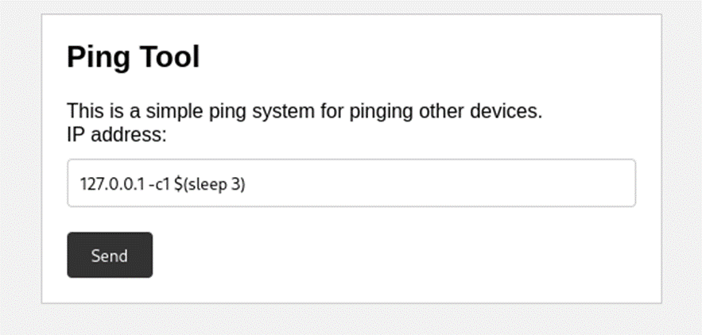

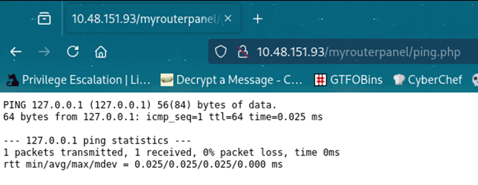

This time it worked, and I received the result after a few seconds. The idea is that instead of using a command that produces visible output, we can use one that does not return output directly.

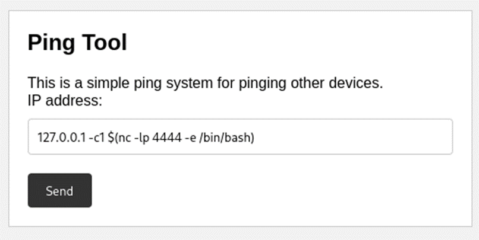

I opened port 4444 using Netcat, allowing me to connect back from the attacker machine.

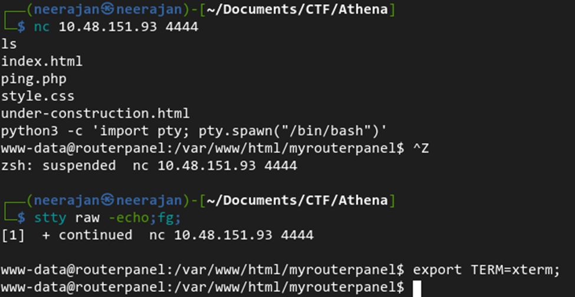

And we got the shell as `www-data`.

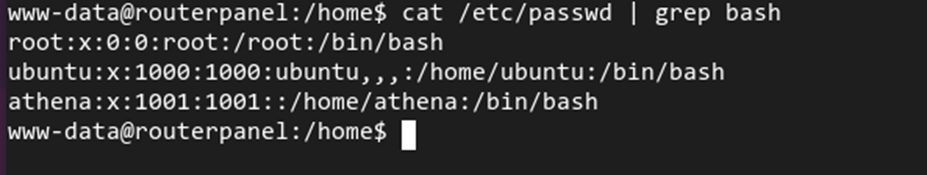

After enumeration, I found three users: `root`, `ubuntu`, and `athena`. Since Athena's home directory was not readable and I couldn't find any credentials in the www directory, I searched for files and folders owned by Athena.

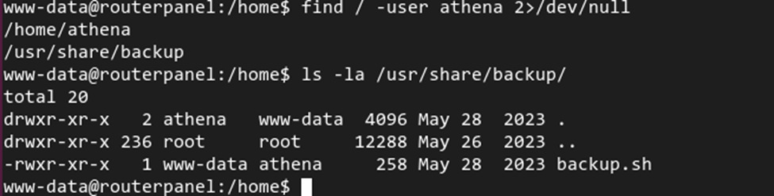

We found a folder in `/usr/share/backup` owned by `www-data` with the group `athena`. Inside it, there was a file named `backup.sh`. Let's read its contents.

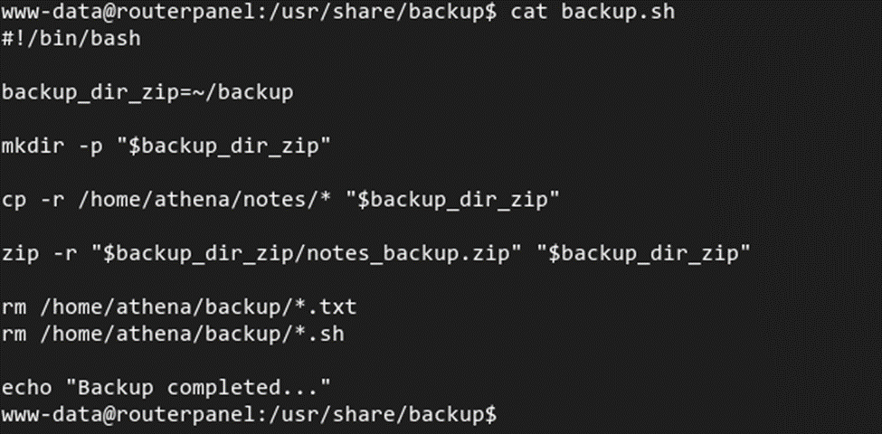

The script appears to back up notes from Athena's home directory. This suggests that a cron job might be executing it periodically. To confirm this, I used `pspy64` to monitor running processes.

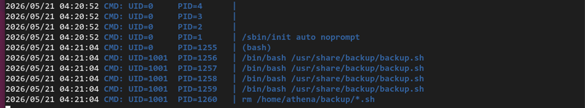

It was confirmed that the script is being executed as a cron job. So I decided to modify it and use it to obtain a reverse shell.

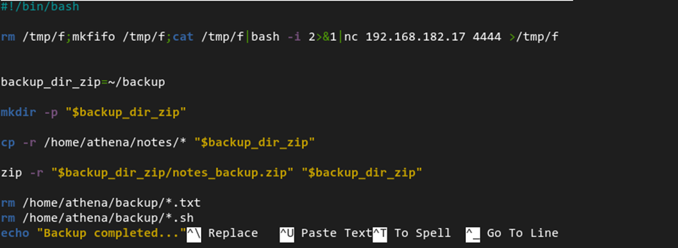

Let's wait for a minute for the cronjob to run.

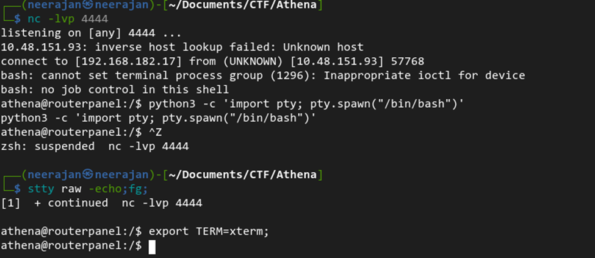

We obtained a shell as the user `athena`. The user flag was located in Athena's home directory.

---

## Privilege Escalation

There were also a few notes in the directory, but they contained no sensitive information. I then proceeded to check what commands the user `athena` could run as root on this machine.

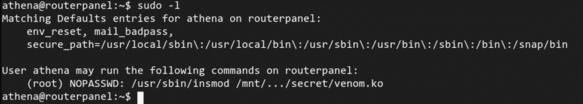

`athena` can run the `insmod` command to load a kernel module named `venom.ko`. The name itself already sounds suspicious.

> `insmod` is a low-level utility used to insert a module directly into the running kernel. Linux uses Loadable Kernel Modules (LKMs) to extend kernel functionality such as adding support for new hardware, filesystems, or system calls without needing to reboot the entire system.

`.ko` files are kernel object files that can be loaded into the Linux kernel. I transferred `venom.ko` to my attacker machine for reverse engineering to understand its behavior.

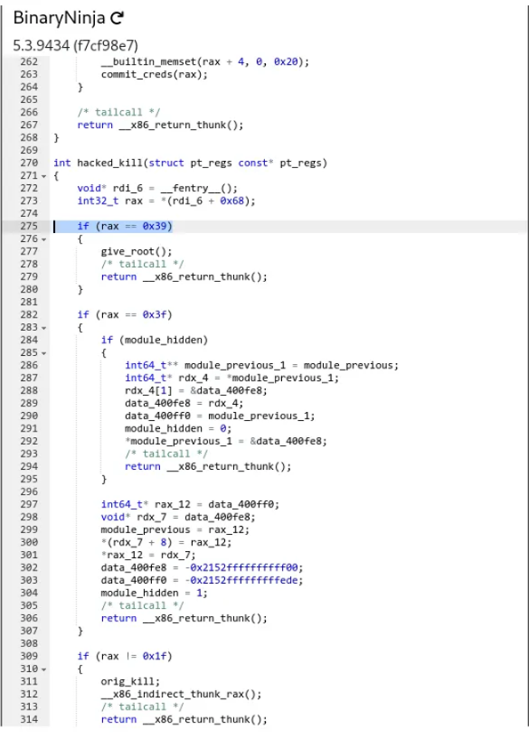

After some research and binary inspection, I identified this as a kernel rootkit behavior similar to [Diamorphine](https://github.com/m0nad/Diamorphine). It hooks the `kill()` system call inside the kernel and inspects the signal argument passed through `pt_regs`.

Instead of only handling normal process signaling, it introduces hidden "backdoor" signals:

- If the signal is **57** (`0x39`), it triggers `give_root()`, effectively escalating the current process to root privileges.
- If the signal is **63** (`0x3f`), it toggles the visibility of the kernel module, allowing it to hide itself from tools like `lsmod` and later reappear when triggered again.

These are not standard `kill()` behaviors and are used as covert control mechanisms by the rootkit.

So, sending signal 57 will escalate privileges:

```bash
kill -57 <pid>  # pid can be of any process — it won't actually kill it
```

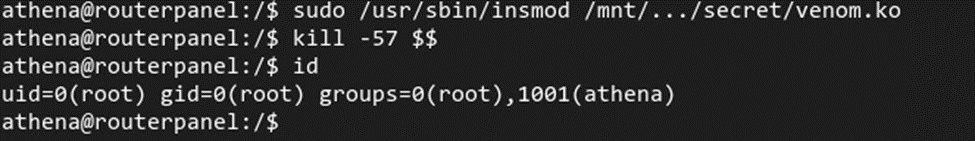

And we got the root shell.

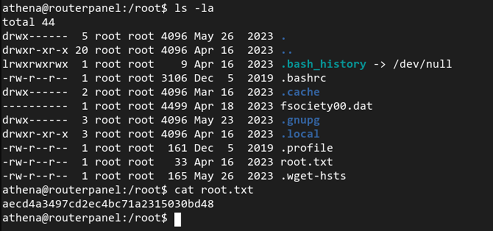

The root flag is located in the `/root` directory. With this, the room is completed.

---

This room was fun, covering everything from enumeration and remote code execution to cron jobs and reverse engineering a rootkit. I learned a lot throughout the process.
